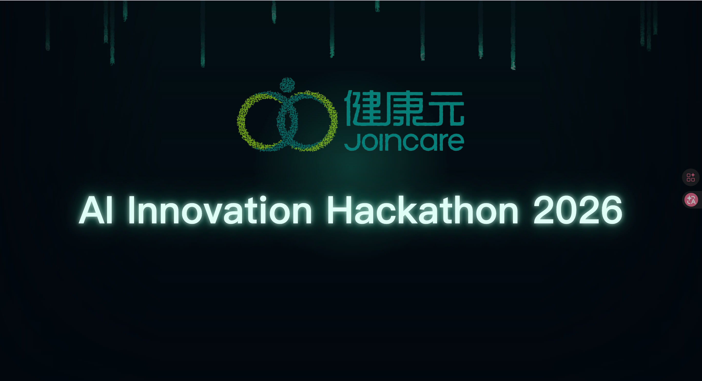
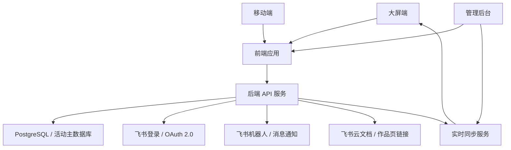

# AI 星锐黑客松平台 PRD（Codex 接力版）

> 适用对象：Codex、前端开发、后端开发、产品经理、活动管理员。  
> 项目名称：AI 星锐黑客松  
> 企业名称：健康元药业集团股份有限公司 / Joincare  
> 当前版本：v0.1  
> 日期：2026-06-16  

## 0. 来源与边界

### 0.1 直接来源

本 PRD 主要依据 Jasper 在对话中提供的完整活动上下文整理，包括：

- 活动定位：面向 2026 届 AI 管培生及内部员工的线下 AI 黑客松赛事平台。
- 活动目标：三天内把 AI 创意做成真实可运行系统。
- 赛事原则：只固定赛道，不固定题目；不接受 PPT、原型图、假 Demo。
- 端侧形态：大屏端、移动端、管理后台。
- 角色权限：管理员、参赛选手、专家评委、大众评委。
- 核心流程：启动仪式、新生破冰、赛道介绍、组队、开发、作品提交、路演、评分、投票、颁奖。
- 评分规则：专家评审均分 x 70% + 大众投票排名赋分 x 30%。

### 0.2 仓库直接证据

当前仓库是一个静态前端展示项目，不是完整生产平台：

- `package.json` 中 `start` 命令为 `python3 -m http.server 5173`，说明当前项目以静态服务器方式运行。
- `index.html` 承载启动页、首页、照片墙、详情弹层、挑战弹层、业务场景页。
- `src/app.js` 负责视图切换、照片墙渲染、详情弹层、抽词和事件绑定。
- `src/logic.js` 存放可测试的纯逻辑，如照片墙布局、关键词抽取、人物数据标准化。
- `data/trainees.json` 是当前新生资料数据源。

### 0.3 飞书能力依据

飞书相关判断依据来自官方开放平台文档：

- 飞书网页应用登录基于 OAuth 2.0，可用于获取用户身份。
- 飞书机器人可用于消息通知。
- 飞书云文档可承载资料、作品说明页和协作文档。

参考链接：

- 飞书网页应用登录：https://open.feishu.cn/document/sso/web-application-sso/login-overview?lang=zh-CN
- 飞书机器人概述：https://open.feishu.cn/document/uAjLw4CM/ukTMukTMukTM/bot-v3/bot-overview?lang=zh-CN
- 飞书开放平台：https://open.feishu.cn/

### 0.4 推理结论

根据用户需求中的登录、角色权限、组队抢赛道、作品提交、审核、专家评分、大众投票、结果计算、日志、导出、实时大屏同步等能力，可以判断：

- 当前静态前端只能作为大屏视觉 Demo 或前端原型基础。
- 真实生产平台必须引入后端服务、数据存储、鉴权、权限控制、实时同步和日志能力。
- 用户已确认希望采用“飞书能力集成优先”，但数据库不使用飞书多维表格作为主库。生产数据应进入正式数据库，飞书主要承担登录、消息通知、云文档/作品页承载等外围能力。

## 1. 产品概述

AI 星锐黑客松平台是健康元药业集团股份有限公司 / Joincare 面向 2026 届 AI 管培生及部分内部员工组织的线下 AI 黑客松赛事平台。

平台覆盖从启动仪式到冠军揭晓的全流程。它既是现场大屏展示系统，也是参赛选手、专家评委、大众评委和管理员共同使用的赛事平台。

赛事主题：

> 药业 AI 业务落地 —— 三天，把 AI 创意做成可运行系统

核心目标：

- 让参赛队伍围绕药业真实业务场景，自由发现问题、定义项目并完成可运行系统。
- 让评委和观众能在统一平台中查看作品、评分、投票。
- 让管理员能控制现场流程、大屏展示、作品审核、投票评分、结果发布。
- 让活动过程数据可沉淀、可复核、可导出。

## Codex 接力说明

后续 Codex 或子 agent 接手时，不应直接进入代码实现。原因是本平台涉及登录、权限、投票、评分、结果发布和大屏控场，这些能力如果没有先定义规则，很容易实现成“页面集合”，而不是现场可用的生产系统。

接力时必须先输出：

1. 技术架构设计。
2. 数据库表结构设计。
3. 后端 API 草案。
4. 页面路由与页面状态说明。
5. 两周排期与 P0/P1/P2 取舍。

不得在规则未确认前直接实现以下能力：

- 登录与权限。
- 投票与评分。
- 结果计算。
- 大屏实时同步。

当前仓库优先作为“大屏视觉资产与交互原型”保留，不建议直接在现有静态结构上硬扩完整生产平台。

后续页面设计的主视觉必须以当前仓库既有风格为基础继续拓展。这里的“当前风格”指：暗色科技背景、code rain、Joincare 启动动画、霓虹青绿/蓝紫发光、像素导航、弧形人物卡片墙、玻璃拟态信息面板、现场仪式感。不得另起一套完全不同的视觉语言。

推荐策略：

1. 保留现有 `index.html`、`src/app.js`、`src/logic.js` 中可复用的大屏视觉、照片墙、抽词逻辑。
2. 新建正式应用结构，用于承载移动端、管理后台、接口调用、权限控制和数据持久化。
3. 如果时间不足，两周版可以先复用现有静态大屏作为 `/screen/*` 的视觉基础。
4. 所有涉及登录、角色、组队、提交、审核、评分、投票、结果计算的能力，必须通过后端 API 和正式数据库实现，不能只存在前端状态中。

## 2. 产品原则

以下原则不可随意改变，后续设计和开发必须优先遵守：

1. 平台从启动仪式开始，而不是从组队开始。
2. 大众评委全流程可看，但只在投票窗口内可操作一次。
3. 参赛选手和专家评委默认不参与大众投票。
4. 比赛只固定赛道，不固定题目。
5. 队伍围绕赛道自由发现问题、自由定义项目。
6. 所有参赛作品必须是真实可运行系统。
7. 不接受 PPT、原型图、假 Demo 作为参赛作品。
8. 大屏是管理员控制的展示端，不是独立用户。
9. 新生档案、破冰互动、赛道、队伍、作品、投票、评分都应后台化、数据化。
10. 前端视觉要有现场感和科技感，但权限与流程必须清晰稳定。

## 3. 术语说明

`PRD（Product Requirements Document，产品需求文档）`：用于描述产品目标、用户角色、功能范围、业务流程、数据结构、验收标准的文档。这里的 PRD 面向 Codex 和开发者，强调可拆解、可实现。

`MVP（Minimum Viable Product，最小可用产品）`：在最短时间内交付核心可用能力的版本。它不是粗糙 Demo，而是优先保证主流程真实可跑。

`RBAC（Role-Based Access Control，基于角色的权限控制）`：根据用户角色决定能看什么、能操作什么。例如选手可以提交作品，专家评委可以评分，大众评委只能投票一次。

`OAuth 2.0（授权登录协议）`：用户通过飞书身份登录平台，平台获取可信用户身份，不需要单独注册账号。

`PostgreSQL（关系型数据库）`：一种成熟的开源数据库，适合保存用户、队伍、作品、评分、投票、结果、日志等需要一致性和可复核的数据。若团队已有 MySQL 规范，也可以用 MySQL 替代，但本 PRD 默认推荐 PostgreSQL。

`飞书集成`：本 PRD 中的飞书主要用于登录、消息通知、作品文档链接和活动协作，不作为投票、评分、结果等核心业务数据的主数据库。

`大屏控制总线`：管理员后台对大屏端发送展示指令的机制。这里的“总线”不是硬件，而是一个统一控制通道。

`实时同步`：当管理员切换阶段、队伍名额变化、投票进度变化时，大屏和移动端能及时看到最新状态。

`落库`：把业务数据保存到数据库中，而不是只存在浏览器内存里。

## 4. 用户角色

### 4.1 管理员

职责：

- 配置活动阶段、赛道、队伍容量、议程、破冰词库。
- 管理新生档案。
- 控制大屏展示内容。
- 开启或关闭组队、作品提交、投票、评分、结果发布。
- 审核作品是否满足真实可运行要求。
- 查看投票和评分进度。
- 发布最终结果。
- 导出活动数据和操作日志。

权限原则：

- 管理员是唯一控场角色。
- 所有关键状态变更必须记录操作日志。

### 4.2 参赛选手

职责：

- 登录移动端。
- 查看大赛介绍、赛制规则、赛道与业务灵感。
- 参与组队和抢赛道。
- 查看本队工作台。
- 提交作品信息、GitLab 仓库、飞书作品页、演示视频、技术栈等。
- 查看审核结果和作品展厅。

权限原则：

- 默认不参与大众投票。
- 只能维护本队相关信息。
- 不能查看专家评分明细。

### 4.3 专家评委

职责：

- 查看作品展厅和项目详情。
- 对每个作品进行五维评分和评语填写。
- 查看自己的评分进度。

权限原则：

- 默认不参与大众投票。
- 评分提交前可修改，提交后是否允许修改由管理员配置。
- 结果发布前，专家评委之间互相不可见评分。

### 4.4 大众评委

职责：

- 全流程观看活动信息。
- 查看作品展厅。
- 在投票窗口内进行一次投票。
- 查看结果揭晓。

权限原则：

- 全流程可看。
- 只在投票窗口内可操作。
- 一人一票。
- 参赛选手和专家评委默认不属于大众投票人群。

### 4.5 大屏端

大屏端不是独立用户。

定位：

- 只读展示端。
- 由管理员后台单向控制。
- 用于现场仪式、议程、组队进度、路演计时、投票进度、冠军揭晓等。

## 5. 赛事赛道

平台只固定赛道，不固定具体题目。赛道用于提供方向、业务说明、参考资料和灵感提示。

### 5.1 临床研发

业务方向示例：

- 临床方案设计
- 临床数据处理与分析
- 受试者招募与管理
- 安全性监测与药物警戒
- 医学文献与真实世界证据挖掘

### 5.2 药学研发

业务方向示例：

- 药物发现
- 靶点与分子筛选
- 药学与制剂工艺研究
- 研发数据处理
- 专利与文献情报挖掘

### 5.3 生产

业务方向示例：

- 生产质量
- 工艺优化
- 设备运维
- 合规与追溯

### 5.4 营销

业务方向示例：

- 市场洞察
- 内容生成
- 渠道与客户运营
- 销售赋能

### 5.5 职能

业务方向示例：

- 人力
- 财务
- 行政
- 董办
- 职能场景提效与自动化

说明：职能赛道不含 IT 方向。

## 6. 端侧形态

### 6.1 大屏端

关键页面：

- 开场主视觉
- 总裁讲话背景
- 新生照片墙
- 破冰互动
- 大赛介绍与流程
- 赛道发布
- 实时组队进度
- 开发倒计时
- 路演计时
- 投票进度
- 冠军揭晓

核心要求：

- 暗色科技风。
- Code rain 视觉。
- Joincare 品牌露出。
- 管理后台单向控制。
- 不承担登录和交互操作。

首页 / 总裁讲话背景页参考：



设计要求：

- 该页面同时作为用户刚进入平台后的首页主视觉，以及总裁讲话环节的背景页参考。
- 主视觉以当前首页风格为基础：深色背景、顶部垂落 code rain、中部 Joincare 标识、下方发光主标题。
- 作为首页时，可在不破坏画面中心秩序的前提下增加少量入口，例如 Enter、进入大赛介绍、进入赛道与业务灵感。
- 作为总裁讲话背景时，应关闭或隐藏入口控件，不承载复杂信息交互。
- 页面要保留足够呼吸感和舞台感，避免叠加流程、表格或过多说明文字。
- 生产页不得出现浏览器插件、调试按钮、浮动工具按钮等非活动内容。
- 可在后台配置主标题、副标题、讲话人姓名和职务，但默认状态应保持极简。

### 6.2 移动端

移动端是选手、专家评委、大众评委的统一入口，根据角色展示不同能力。

选手关键页面：

- 首页入口
- 大赛介绍
- 赛道与业务灵感
- 抢赛道与本队工作台
- 作品提交
- 作品展厅

专家评委关键页面：

- 作品展厅
- 项目详情
- 五维评分与评语
- 评分进度

大众评委关键页面：

- 全程观看
- 作品展厅
- 投票窗口
- 结果揭晓

### 6.3 管理后台

关键页面：

- 流程控制台
- 大屏控制
- 新生档案管理
- 破冰词库与主持记录
- 赛道与组队管理
- 交付审核
- 投票与评分管理
- 结果发布
- 数据导出与日志

核心要求：

- 管理后台是唯一控场入口。
- 后台应优先清晰稳定，不追求过度视觉炫酷。
- 所有关键动作要有日志。

## 7. 活动全流程

### 7.1 上午：现场仪式与企业介绍

1. 启动仪式
   - 平台职责：展示主视觉。
   - 大屏内容：AI 星锐黑客松主视觉、Joincare 品牌、活动主题。

2. 新生破冰
   - 平台职责：展示新生照片墙、个人档案、破冰互动。
   - 大屏内容：新生卡片、抽词、主持人记录句子。

3. 总裁讲话
   - 平台职责：提供讲话背景视觉。
   - 大屏内容：品牌背景、主题标题。
   - 视觉参考：`docs/assets/president-speech-reference.png`。该图同时是平台首页主视觉参考；用于讲话阶段时，应隐藏首页入口控件，作为讲话前、中、后的稳定背景展示。

4. 企业文化与企业整体情况介绍
   - 平台职责：展示议程和背景。
   - 大屏内容：企业介绍背景、议程提示。

### 7.2 下午：赛制导入与赛道讲解

1. 主办统一讲解大赛整体议程与全流程机制
   - 平台职责：展示大赛介绍、规则、奖项、评分方式。
   - 大屏内容：赛事主题、赛制、交付要求、评分模型、奖项说明。

2. 各赛道介绍与灵感提示讲解
   - 平台职责：展示五条赛道、业务方向、参考资料。
   - 大屏内容：临床研发、药学研发、生产、营销、职能五条赛道。

### 7.3 正式赛事

1. 组队抢赛道
   - 移动端：选手选择赛道、加入队伍或确认队伍。
   - 后台：管理员开启/关闭组队，调整成员，处理异常。
   - 大屏：实时展示各赛道名额和组队进度。

2. 封闭开发
   - 移动端：选手查看本队工作台、开发要求、提交入口。
   - 后台：管理员查看队伍状态。
   - 大屏：开发倒计时、当前阶段提示。

3. 作品提交
   - 移动端：队伍提交作品信息。
   - 后台：管理员审核作品。
   - 大屏：可展示提交进度。

4. 路演与评审
   - 移动端：专家评委查看作品并评分。
   - 后台：管理员控制路演计时、查看评分进度。
   - 大屏：展示当前路演队伍、倒计时。

5. 大众投票
   - 移动端：大众评委在投票窗口内投票一次。
   - 后台：管理员开启/关闭投票，监控异常。
   - 大屏：展示投票进度，不提前泄露结果。

6. 结果公布与颁奖
   - 后台：管理员确认最终结果并发布。
   - 大屏：冠军揭晓。
   - 移动端：查看最终结果。

## 8. 两周交付主线与范围

两周活动版的第一优先级不是做完所有页面，而是跑通以下 P0 主链路闭环：

```text
管理员导入用户名单
→ 用户通过飞书或备用 token 登录
→ 系统识别角色
→ 管理员开启组队
→ 选手加入队伍并选择赛道
→ 队伍提交作品
→ 管理员审核通过
→ 专家评委评分
→ 管理员开启大众投票
→ 大众评委投票一次
→ 系统计算综合得分
→ 管理员确认发布
→ 大屏展示冠军结果
→ 管理员导出数据与日志
```

### 8.1 P0-A 现场主链路必须完成

`P0-A` 指没有它现场主流程会断的能力。

- 飞书登录或兜底 token 登录。
- 用户角色识别与路由权限。
- 活动状态机与管理员阶段控制。
- 赛道列表与容量配置。
- 组队抢赛道，含后端容量校验。
- 队伍工作台。
- 作品提交与管理员审核。
- 审核通过作品展厅。
- 专家评分，含评分进度。
- 大众投票，含一人一票幂等校验。
- 结果计算、预览、发布。
- 大屏展示当前阶段、组队进度、路演倒计时、投票进度、结果揭晓。
- 核心数据导出。

### 8.2 P0-B 两周版必须有的兜底能力

`P0-B` 指可以简化界面，但必须有操作入口和数据记录的能力。

- 管理员代创建队伍、代调整成员。
- 管理员代提交或修改作品。
- 管理员手动补录评分。
- 管理员手动关闭投票和评分。
- 关键操作日志。
- 大屏手动刷新和固定页面展示。
- 投票、评分、结果发布前的数据导出备份。

### 8.3 P1 尽量完成

`P1` 指有它体验更完整，但没有也能人工兜底的能力。

- 新生档案后台维护。
- 破冰词库后台维护。
- 主持人破冰记录持久化。
- 飞书机器人通知。
- 评分进度提醒。
- 投票异常标记。
- 更完整的大屏动画效果。

### 8.4 P2 活动后补齐

`P2` 指活动后产品化再做的能力。

- 多活动复用。
- 完整配置后台。
- PostgreSQL / MySQL 的迁移、备份、审计和监控补强。
- 高级审计。
- BI 统计看板。
- 多租户权限。
- 长期作品沉淀门户。

## 9. 活动状态机

`状态机（State Machine，固定状态与允许流转的规则）`：用固定状态和允许的状态流转来约束系统行为，避免管理员误操作或用户在错误时间提交数据。

活动状态枚举：

- `not_started`：未开始。
- `opening`：启动仪式。
- `icebreaker`：破冰互动。
- `track_intro`：赛道介绍。
- `team_open`：组队开放。
- `team_locked`：组队锁定。
- `development`：开发中。
- `submission_open`：作品提交开放。
- `submission_locked`：作品提交锁定。
- `reviewing`：作品审核中。
- `roadshow`：路演中。
- `scoring_open`：专家评分开放。
- `voting_open`：大众投票开放。
- `calculating`：结果计算中。
- `published`：结果已发布。

核心规则：

- 只有管理员可切换活动状态。
- 每次状态切换必须写入操作日志。
- 移动端按钮可见性由活动状态和用户角色共同决定。
- 大屏展示内容由当前活动状态和管理员指定页面共同决定。
- 状态不允许随意回退；如需回退，必须二次确认并记录原因。

关键操作受状态约束：

- 组队未开启：选手不可加入或创建队伍。
- 组队已关闭：选手不可自行更换赛道或队伍，管理员可代操作并记录日志。
- 作品提交未开启：选手不可提交作品。
- 作品提交已关闭：选手不可修改作品，管理员可退回并临时开启补交。
- 评分未开启：专家不可提交评分。
- 评分已冻结：专家和管理员均不可修改原始评分，只能作废并重算快照。
- 投票未开启：大众评委不可投票。
- 投票已关闭：不可新增投票。
- 结果已发布：移动端和大屏只能读取结果快照。

## 10. 核心功能模块

### 10.1 开场与仪式模块

功能：

- 开场主视觉。
- 大赛介绍。
- 议程展示。
- 总裁讲话背景。
- 企业介绍背景。

要求：

- 支持后台切换展示状态。
- 支持大屏展示。
- 内容不应写死在前端，至少应可配置标题、副标题、议程、视觉图。

### 10.2 新生档案模块

功能：

- 管理新生资料。
- 展示新生照片墙。
- 展示个人介绍卡片。

字段建议：

- 姓名
- 英文名或拼音名
- 部门
- 专业背景
- AI 搭子
- 本命 AI 工具
- 想让 AI 解决的问题
- AI 超能力
- 有趣事实
- 生活照
- 表情包

要求：

- 后台可增删改查。
- 大屏可展示。
- 移动端可查看。

### 10.3 破冰互动模块

功能：

- 破冰词库配置。
- 抽取规则配置。
- 主持人记录句子。
- 记录与新生绑定。

要求：

- 词库后台可维护。
- 抽取结果和主持记录应持久化。
- 不能只保存在浏览器本地。

### 10.4 大赛介绍与赛事机制模块

功能：

- 展示赛事主题。
- 展示主办方和面向对象。
- 展示赛制、交付要求、评分规则、奖项设置。
- 展示完整活动流程。

可见性：

- 全员公开。
- 大屏和移动端均可展示。

### 10.5 赛道与业务灵感模块

功能：

- 展示五条推荐赛道。
- 展示业务方向示例。
- 展示参考资料和灵感提示。

要求：

- 不设计成固定题目列表。
- 队伍可以自由发现问题、自由定义项目。

### 10.6 组队抢赛道模块

功能：

- 管理员开启/关闭组队。
- 选手抢赛道或加入队伍。
- 赛道满员后锁定。
- 管理员手动微调或自动补全。
- 大屏实时展示进度。

关键规则：

- 先到先得。
- 满员锁定。
- 管理员可干预。

### 10.7 队伍工作台模块

功能：

- 展示本队成员。
- 展示所选赛道。
- 展示开发状态。
- 展示作品提交入口。
- 展示关键时间节点。

权限：

- 只有本队成员可编辑本队信息。
- 管理员可查看和调整所有队伍。

### 10.8 作品提交与审核模块

功能：

- 队伍提交作品信息。
- 管理员审核作品。
- 审核通过后发布到作品展厅。
- 审核不通过则退回修改。

作品字段建议：

- 项目名称
- 所属赛道
- 队伍名称
- 成员
- 业务问题
- 价值主张
- 解决方案摘要
- GitLab 仓库
- 飞书作品页
- 演示视频
- 技术栈
- 可运行说明
- 审核状态
- 审核意见

审核原则：

- 必须真实可运行。
- 不接受 PPT、原型图、假 Demo。

“真实可运行系统”指作品必须至少满足以下条件：

- 有可访问的运行入口，或可按说明在评审现场启动。
- 有真实交互流程，不只是静态截图、PPT 或 Figma 原型。
- 核心 AI 能力至少有一个可演示的输入与输出闭环。
- 提交材料中必须包含运行说明、仓库地址或部署地址、演示视频或现场演示方式。

### 10.9 作品展厅模块

功能：

- 展示所有审核通过作品。
- 支持按赛道筛选。
- 支持查看项目详情。

角色差异：

- 选手：查看公开作品。
- 专家评委：查看评分所需信息。
- 大众评委：查看投票所需信息。
- 管理员：查看所有作品和审核状态。

### 10.10 专家评分模块

功能：

- 专家评委对作品进行五维评分。
- 支持评语填写。
- 支持评分进度查看。

五维评分项待产品确认。建议占位：

- 业务价值
- AI 使用深度
- 技术完成度
- 可运行演示质量
- 表达与落地潜力

权限：

- 专家评分在结果发布前互相不可见。
- 管理员可查看评分提交状态。

### 10.11 大众投票模块

功能：

- 管理员开启/关闭投票窗口。
- 大众评委投票一次。
- 系统记录投票人、投票作品、时间。
- 支持异常投票标记。

规则：

- 一人一票。
- 只有大众评委可投。
- 选手和专家评委默认不可投。

### 10.12 结果计算与发布模块

功能：

- 计算专家评分均分。
- 计算大众投票排名赋分。
- 计算综合得分。
- 生成最终排名。
- 管理员确认并发布结果。

公式：

```text
最终综合得分 = 专家评审均分 x 70% + 大众投票排名赋分 x 30%
```

大众投票排名赋分：

```text
第 1 名：100
第 2 名：85
第 3 名：70
第 4 名：55
```

奖项：

- 仅设置单一冠军奖：Grand Prize。
- 不另设其他奖项。

### 10.13 数据导出与日志模块

功能：

- 导出队伍数据。
- 导出作品数据。
- 导出评分数据。
- 导出投票数据。
- 导出结果数据。
- 记录关键操作日志。

关键日志：

- 阶段切换
- 赛道配置修改
- 队伍调整
- 作品审核
- 投票开启/关闭
- 评分开启/关闭
- 结果发布

## 11. 数据模型草案

### 11.1 用户表 Users

字段：

- user_id
- feishu_open_id
- name
- department
- role
- phone_or_email
- is_active
- created_at
- updated_at

角色枚举：

- admin
- contestant
- expert_judge
- public_judge

### 11.2 赛道表 Tracks

字段：

- track_id
- name
- description
- business_examples
- capacity
- mentor
- status
- sort_order

### 11.3 队伍表 Teams

字段：

- team_id
- team_name
- track_id
- captain_user_id
- member_user_ids
- project_topic
- status
- created_at
- updated_at

### 11.4 作品表 Projects

字段：

- project_id
- team_id
- track_id
- project_name
- business_problem
- value_proposition
- solution_summary
- gitlab_url
- feishu_doc_url
- demo_video_url
- tech_stack
- run_instruction
- audit_status
- audit_comment
- published_at

审核状态枚举：

- draft
- submitted
- approved
- rejected
- published

### 11.5 专家评分表 ExpertScores

字段：

- score_id
- project_id
- judge_user_id
- business_value_score
- ai_depth_score
- technical_completion_score
- demo_quality_score
- presentation_score
- comment
- submitted_at

### 11.6 大众投票表 PublicVotes

字段：

- vote_id
- voter_user_id
- project_id
- voted_at
- abnormal_flag
- abnormal_reason

唯一性规则：

- voter_user_id 全局唯一投票一次。

### 11.7 结果表 Results

字段：

- result_id
- project_id
- expert_average_score
- public_vote_count
- public_vote_rank
- public_vote_score
- final_score
- final_rank
- award
- published

### 11.8 操作日志表 OperationLogs

字段：

- log_id
- operator_user_id
- action
- target_type
- target_id
- before_value
- after_value
- created_at

### 11.9 活动表 Events

字段：

- event_id
- event_name
- start_at
- end_at
- timezone
- status：draft / active / finished / archived
- current_stage_id
- created_at
- updated_at

说明：

- 所有用户、队伍、作品、评分、投票、结果必须归属于同一个 event_id。
- 即使当前只有一场活动，也必须保留 event_id，避免后续数据导出和复盘混乱。

### 11.10 用户角色分配表 RoleAssignments

字段：

- assignment_id
- event_id
- user_id
- role：admin / contestant / expert_judge / public_judge
- scope_type：global / track / team / project
- scope_id
- granted_by
- granted_at
- revoked_at
- is_active

权限冲突规则：

- 一个用户可以拥有多个角色。
- 后端权限判断必须基于 RoleAssignments，而不是 Users.role 单字段。
- 大众投票资格默认采用排除规则：只要用户在当前 event_id 下拥有 contestant 或 expert_judge 身份，则不可投票，除非管理员显式配置 vote_override=true。
- 管理员默认不可投票、不可专家评分；如需代操作，必须走 admin_proxy_action 并写入日志。

### 11.11 队伍成员表 TeamMembers

字段：

- team_member_id
- event_id
- team_id
- user_id
- member_role：captain / member
- join_status：invited / joined / removed
- joined_at
- removed_at

唯一性规则：

- 同一 event_id 下，一个 contestant 只能加入一个 active team。
- 队长 captain 在同一队伍内只能有一个。
- team_id + user_id 唯一，防止重复加入同一队伍。

### 11.12 投票场次表 VoteSessions

字段：

- vote_session_id
- event_id
- name
- status：draft / open / closed / frozen
- open_at
- close_at
- allow_override
- created_by
- updated_at

### 11.13 评分场次表 ScoreSessions

字段：

- score_session_id
- event_id
- status：draft / open / closed / frozen
- allow_resubmit_before_close
- created_by
- updated_at

### 11.14 评分维度表 ScoreDimensions

字段：

- dimension_id
- event_id
- name
- description
- min_score
- max_score
- weight
- sort_order
- is_active

### 11.15 结果快照表 ResultSnapshots

字段：

- snapshot_id
- event_id
- score_session_id
- vote_session_id
- calculation_version
- input_hash
- result_json
- generated_by
- generated_at
- published_at
- published_by

说明：

- 每次管理员点击“生成结果”都创建快照。
- 发布结果时只能发布某一个固定快照，不能展示实时浮动计算值。
- input_hash 用于复核本次结果基于哪一批评分和投票数据。

### 11.16 幂等记录表 IdempotencyKeys

字段：

- idempotency_key
- event_id
- user_id
- action
- request_hash
- response_snapshot
- created_at
- expires_at

说明：

- `幂等（Idempotency）` 指同一个请求重复提交多次，最终结果仍等同于成功提交一次。
- 现场网络差时，移动端重复点击提交很常见，因此投票、评分、提交、发布等写操作必须具备幂等保护。

### 11.17 外部集成同步状态表 ExternalSyncStates

字段：

- sync_id
- event_id
- entity_type
- entity_id
- provider：feishu / gitlab / other
- external_record_id
- sync_status：pending / synced / failed
- last_error
- retry_count
- updated_at

说明：

- 该表只用于记录外部系统同步状态，不承担主业务数据存储。
- 业务主键使用系统数据库生成的 user_id、team_id、project_id 等。
- 遇到飞书 API 频控、GitLab API 失败或其他外部写入失败时，后端应记录 pending_sync 状态，并允许管理员重试同步。

## 12. 权限矩阵

| 功能 | 管理员 | 参赛选手 | 专家评委 | 大众评委 | 大屏 |
| --- | --- | --- | --- | --- | --- |
| 查看大赛介绍 | 可 | 可 | 可 | 可 | 可 |
| 查看赛道灵感 | 可 | 可 | 可 | 可 | 可 |
| 管理赛道 | 可 | 不可 | 不可 | 不可 | 不可 |
| 参与组队 | 可代操作 | 可 | 不可 | 不可 | 展示 |
| 查看本队工作台 | 可 | 可 | 不可 | 不可 | 不可 |
| 提交作品 | 可代操作 | 可 | 不可 | 不可 | 不可 |
| 审核作品 | 可 | 不可 | 不可 | 不可 | 不可 |
| 查看作品展厅 | 可 | 可 | 可 | 可 | 可 |
| 专家评分 | 不建议代评 | 不可 | 可 | 不可 | 不可 |
| 大众投票 | 不可或按配置 | 默认不可 | 默认不可 | 可一次 | 不可 |
| 结果计算 | 可 | 不可 | 不可 | 不可 | 不可 |
| 结果发布 | 可 | 不可 | 不可 | 不可 | 展示 |
| 数据导出 | 可 | 不可 | 不可 | 不可 | 不可 |
| 大屏控制 | 可 | 不可 | 不可 | 不可 | 被控 |

### 12.1 权限判定顺序

后端权限必须按以下顺序判断：

1. 用户是否登录且 is_active=true。
2. 用户是否属于当前 event_id。
3. 当前活动阶段是否允许该操作。
4. 用户是否拥有该操作所需角色。
5. 用户是否拥有该资源的 scope 权限，例如本队、本赛道、本作品。
6. 是否命中排除规则，例如选手和专家评委默认不能大众投票。
7. 是否命中幂等规则或唯一性规则。

所有前端隐藏按钮只作为体验优化，不能作为权限依据。最终权限必须以后端判断为准。

### 12.2 并发与幂等规则

`并发（Concurrency）`：多人同时操作同一资源，例如多人同时抢最后一个赛道名额。  
`幂等（Idempotency）`：同一个请求重复提交多次，最终结果仍然只生效一次，例如用户连点投票按钮也只记录一票。

规则：

- 组队抢赛道必须由后端完成容量校验，不能只在前端判断。
- 同一用户只能属于一个队伍。
- 同一队伍只能选择一个赛道。
- 赛道容量满后，后端必须拒绝新的加入请求。
- 大众投票接口必须以 voter_user_id 做唯一约束，重复提交返回已有投票结果。
- 专家评分接口必须以 project_id + judge_user_id 做唯一约束。
- 结果计算必须基于已锁定的评分和投票数据，发布后默认不可重算；如需重算，必须管理员确认并记录日志。

### 12.3 API 幂等要求

所有写接口必须由后端生成或校验 idempotency_key：

- POST /api/votes
- POST /api/scores
- POST /api/projects/submit
- POST /api/admin/stage
- POST /api/admin/results/generate
- POST /api/admin/results/publish

接口规则：

- 客户端每次提交生成 idempotency_key。
- 后端保存 idempotency_key、user_id、action、request_hash、response_snapshot。
- 同一用户重复提交同一 idempotency_key 时，返回第一次响应。
- 同一 idempotency_key 但 request_hash 不一致时，返回冲突错误。
- 投票和评分接口必须同时依赖后端唯一约束，不能只依赖前端禁用按钮。

## 13. 技术实现边界与推荐架构

### 13.1 两周交付建议

用户已确认：

- 希望采用标准产品化版本的完整度。
- 但实际希望两周内实现目标。
- 资源为 1 名前端 + 1 名后端。
- 飞书能力集成优先，但核心数据库独立。

因此建议两周目标定义为：

> 生产可用活动版，而不是长期产品化完整版。

生产可用活动版的标准：

- 主链路真实可跑。
- 角色权限不混乱。
- 数据真实保存。
- 结果可复核。
- 现场关键节点可由后台控制。
- 出现异常时有人工兜底方案。

### 13.2 推荐架构



说明：

- 前端应用承载大屏端、移动端、管理后台。
- 后端 API 统一处理鉴权、权限、业务规则。
- PostgreSQL 是活动主数据库，保存用户、角色、队伍、作品、投票、评分、结果、日志。
- 飞书登录提供用户身份。
- 飞书机器人用于通知。
- 飞书云文档可承载作品说明页或协作文档链接，但不作为核心业务数据源。
- 实时同步服务用于大屏控制和进度更新。

### 13.3 技术选型建议

前端：

- React 或 Vue 均可。
- 如果延续当前仓库，可先保留静态大屏作为视觉资产，再新建应用结构。

后端：

- Node.js / NestJS 或 Express。
- 选择理由：飞书开放平台 SDK 和 Web API 集成较方便，两周内开发效率较高。

数据：

- 两周版：PostgreSQL 优先；如果公司已有 MySQL 标准，可替换为 MySQL。
- 飞书多维表格不作为主数据库。最多用于人工协作视图、临时导入导出或运营备份。
- 产品化版：继续使用 PostgreSQL/MySQL，并补齐迁移、备份、审计和监控。

实时同步：

- 两周版：Server-Sent Events 或 WebSocket。
- 如果只服务现场大屏，也可用后台状态轮询作为兜底。

部署：

- 公司内网服务器、云服务器或 Vercel/Netlify + API 服务。
- 生产活动前必须完成一次现场网络彩排。

## 14. 评分计算与飞书集成细则

### 14.1 评分计算细则

专家评分：

- 每个维度采用 0-100 分。
- 每个项目的单个专家总分 = Σ(维度得分 x 维度权重)。
- 项目专家评分 = 已提交专家总分的平均值。
- 未提交评分的专家不计入平均值，但后台必须展示缺评名单。
- 若某项目有效专家评分数低于最低要求，结果生成页必须提示管理员确认。

大众投票：

- 只统计 validity_status=valid 的投票。
- 并列票数采用并列排名。例如两个项目同为第一，则都获得第一名赋分，下一名按第三名计算。
- 排名赋分：
  - 第 1 名：100
  - 第 2 名：85
  - 第 3 名：70
  - 第 4 名：55
  - 第 5 名及以后：40
- 如果不希望第 5 名以后同分，需在赛前明确线性递减规则。

综合得分：

- final_score = expert_average_score x 0.7 + public_vote_score x 0.3。
- final_score 保留 2 位小数。
- final_score 相同时，依次按 expert_average_score、business_value_score、public_vote_count 排序。
- 仍然并列时，由管理员线下确认，并在发布日志中记录原因。

### 14.2 飞书集成边界

飞书登录：

- 使用飞书网页应用 OAuth 2.0 登录。
- 后端使用授权码换取用户访问凭证，再获取用户身份信息。
- Users 表必须保存 feishu_open_id，并建议同时保存 feishu_union_id / feishu_user_id，具体以应用权限审批结果为准。
- 若无法按期获得手机号或邮箱权限，不得依赖 phone_or_email 作为唯一身份。

飞书云文档：

- 可作为作品说明页、路演材料、参考资料和赛道资料的承载位置。
- 数据库只保存飞书文档链接、标题、提交人、提交时间、审核状态等元数据。
- 作品评分、投票、结果发布不得依赖飞书文档内容实时读取。

飞书机器人：

- 机器人只用于通知，不作为业务状态的唯一来源。
- 通知失败不能阻断评分、投票、提交等主流程。
- Webhook 地址、签名密钥等必须只保存在服务端环境变量中，不能进入前端代码或仓库。

### 14.3 数据库与飞书的职责分工

正式数据库负责：

- 用户与角色。
- 活动状态。
- 赛道、队伍、队员。
- 作品提交与审核状态。
- 专家评分。
- 大众投票。
- 结果快照。
- 操作日志。

飞书负责：

- 企业身份登录。
- 机器人通知。
- 云文档协作与作品页链接。
- 活动资料沉淀。

不允许：

- 不允许前端直接写核心业务数据。
- 不允许把投票、评分、结果快照只存在飞书文档或多维表格中。
- 不允许以飞书通知发送成功作为业务状态成功的判断标准。

## 15. 页面清单

### 15.1 大屏端

- `/screen/opening`
- `/screen/intro`
- `/screen/trainees`
- `/screen/icebreaker`
- `/screen/rules`
- `/screen/tracks`
- `/screen/team-progress`
- `/screen/countdown`
- `/screen/roadshow`
- `/screen/vote-progress`
- `/screen/award`

### 15.2 移动端

- `/mobile/home`
- `/mobile/rules`
- `/mobile/tracks`
- `/mobile/team`
- `/mobile/workspace`
- `/mobile/submit`
- `/mobile/gallery`
- `/mobile/project/:id`
- `/mobile/vote`
- `/mobile/result`
- `/mobile/judge/scores`

### 15.3 管理后台

- `/admin/dashboard`
- `/admin/stage-control`
- `/admin/screen-control`
- `/admin/trainees`
- `/admin/icebreaker`
- `/admin/tracks`
- `/admin/teams`
- `/admin/projects`
- `/admin/votes`
- `/admin/scores`
- `/admin/results`
- `/admin/exports`
- `/admin/logs`

## 16. 验收标准

### 16.1 身份与权限

- 用户可通过飞书身份登录。
- 登录后系统能识别角色。
- 不同角色看到不同入口。
- 选手和专家评委默认不能进行大众投票。
- 大众评委只能投票一次。

### 16.2 组队与赛道

- 管理员可开启/关闭组队。
- 选手可选择赛道并进入队伍。
- 赛道名额满后自动锁定。
- 管理员可手动调整队伍。
- 大屏可展示组队进度。

### 16.3 作品提交与审核

- 队伍可提交作品信息。
- 管理员可审核通过或退回。
- 审核通过作品进入作品展厅。
- 审核状态可追踪。

### 16.4 评分与投票

- 专家评委可对作品评分并提交评语。
- 管理员可查看评分进度。
- 大众评委只能在投票窗口投票。
- 投票结束后系统可计算大众排名赋分。

### 16.5 结果发布

- 系统按公式计算最终得分。
- 管理员可确认并发布结果。
- 大屏可展示冠军揭晓。
- 移动端可查看最终结果。

### 16.6 数据与日志

- 用户、队伍、作品、评分、投票、结果均可保存。
- 关键操作有日志。
- 活动结束后可导出核心数据。

### 16.7 端到端验收用例

1. 管理员导入用户名单，分别包含选手、专家评委、大众评委。
2. 选手 A 登录后只能看到选手入口，不能进入评分页和投票提交接口。
3. 管理员开启组队，选手 A 加入赛道，赛道满员后其他选手加入失败。
4. 队伍提交作品，管理员审核通过后，作品出现在展厅。
5. 专家评委对所有作品评分，提交后管理员能看到评分进度。
6. 大众评委在投票开启前不能投票，开启后只能投一次。
7. 管理员关闭投票后，系统计算最终排名。
8. 管理员发布结果后，大屏展示冠军，移动端展示结果。
9. 管理员导出用户、队伍、作品、评分、投票、结果和日志。

## 17. 视觉与品牌要求

主标题：

> AI 星锐黑客松

企业名：

> 健康元药业集团股份有限公司 / Joincare

Slogan：

> 三天，把 AI 创意做成可运行系统

视觉基调：

- 暗色科技。
- Code rain。
- Joincare 品牌。
- 现场仪式感。
- 以当前仓库已有视觉为主风格，在其基础上拓展三端页面。

强调色：

- 青
- 蓝
- 绿
- 紫
- 奖项金

要求：

- 后续页面的主视觉必须继承当前静态前端的风格资产和交互气质，包括启动动画、code rain、霓虹发光、像素导航、弧形人物卡片墙、玻璃面板、青绿/蓝紫高亮。
- 大屏端可以在当前风格上增强舞台感、倒计时、结果揭晓、赛道发布等仪式化表达，但不能改成传统后台大屏、普通表格看板或完全不同的品牌风格。
- 移动端和管理后台可以降低动画强度，但仍需延续同一套色彩、字体层级、按钮语言和信息面板质感，形成同一产品体系。
- 新增页面时应优先复用当前仓库中已验证的视觉元素，再按业务场景扩展组件，而不是重做一套无关设计。
- 大屏可以更有冲击力。
- 移动端和后台必须清晰可用。
- 不要把后台做成只有炫酷视觉但难以操作的界面。

### 17.1 当前风格可复用资产

直接证据来自当前仓库：

- `index.html`：已有启动页、首页、照片墙、详情弹层、挑战弹层、业务场景页这些视觉场景。
- `styles.css`：已有暗色科技配色、霓虹边框、像素导航、玻璃面板、照片墙卡片样式。
- `src/code-rain.js`：已有 canvas code rain 背景。
- `src/intro.js`：已有 Joincare 启动动画。
- `src/app.js`：已有视图切换、照片墙、详情弹层、抽词互动逻辑。
- `assets/joincare-full-clean.png`、`assets/joincare-cyber-icon.png` 等：已有品牌视觉素材。
- `docs/assets/president-speech-reference.png`：平台进入首页与总裁讲话背景页共用参考图，体现当前首页风格在正式讲话场景中的复用。

推理结论：

- 后续大屏页面应优先从这些资产中延展，而不是重新定义品牌视觉。
- 移动端和后台可以更克制，但仍应保持“同一平台”的视觉识别。
- 如果新增组件与当前风格冲突，应优先调整新组件，而不是替换当前主视觉。

## 18. 风险与兜底

### 18.1 飞书权限审批风险

风险：

- 企业自建应用权限可能无法在两周内审批完成。

兜底：

- 准备手动导入用户白名单。
- 准备用公开链接 + 一次性 token 的轻量登录。
- 准备管理员代操作能力。

### 18.2 数据库与部署风险

风险：

- 两周内引入正式数据库，需要保证部署、备份、连接池、权限和环境变量配置正确。
- 如果没有公司现成数据库环境，后端需要同步承担数据库运维配置。

兜底：

- 优先选择团队熟悉的 PostgreSQL 或 MySQL 托管环境。
- 活动前完成一次全量数据备份演练。
- 投票关闭后、结果发布前必须导出评分、投票、计算结果三份数据。
- 管理后台提供手动录入评分和投票结果的应急入口。

### 18.3 现场网络风险

风险：

- 现场 Wi-Fi 不稳定会影响移动端投票、评分和大屏同步。

兜底：

- 大屏关键页面可缓存。
- 管理员后台提供手动刷新。
- 投票和评分提供延迟提交重试。

### 18.4 权限误操作风险

风险：

- 管理员误开投票、误发布结果。

兜底：

- 关键动作二次确认。
- 发布结果前预览。
- 关键状态变更写入日志。

### 18.5 大屏断线风险

风险：

- 大屏设备网络中断或浏览器刷新失败，会影响现场展示节奏。

兜底：

- 大屏保留最后一次成功拉取的展示状态。
- 管理后台提供固定页面展示和手动刷新能力。
- 关键颁奖画面准备静态兜底页。

## 19. 非本期范围

两周生产可用活动版不建议包含：

- 多活动复用平台。
- 完整低代码配置后台。
- 复杂 BI 看板。
- 完整审计系统。
- 多租户权限体系。
- 高并发公网活动能力。
- 自动识别假 Demo 的技术检测。

## 20. 后续给 Codex 的实施提示

如果后续 Codex 基于本 PRD 继续工作，建议按以下顺序拆任务：

1. 先输出技术架构设计：前端、后端、数据库、飞书登录/通知、实时同步、部署。
2. 再输出数据库表设计：字段、字段类型、唯一性规则、索引、迁移方式。
3. 再输出接口设计：登录、角色、赛道、队伍、作品、评分、投票、结果。
4. 再输出页面原型：大屏端、移动端、后台。
5. 再输出两周排期：按天拆到前端和后端任务。
6. 最后进入代码实现。

开发时必须优先保证：

- 主链路跑通。
- 权限正确。
- 数据可复核。
- 现场可控。
- 有人工兜底。
