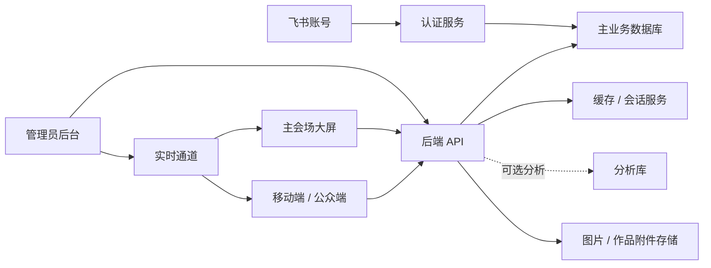

# 管理后台与平台技术架构方案 v1

更新时间：2026-06-23

## 1. 背景与目标

当前项目已经形成三类界面：

- 主会场大屏：`index.html`、`screen.html`、`src/screen.js`，负责开场、星锐卡组、赛道组队、倒计时、路演、投票与结果展示。
- 移动端 / 公众端：`site.html`、`src/site.js`、`src/site.css`，负责首页、星锐、新人详情、赛程、组队、作品展厅、投票、评分、角色工作台。
- 管理后台：`admin.html`、`admin.css`、`src/admin.js`，当前主要实现流程控制台、大屏预览、安全确认和操作日志。

现有后端是轻量 Node HTTP 服务，入口为 `server/index.js`，数据主要读写 `data/*.json`。它适合本地演示和短期会场联调，但如果要接入飞书登录、权限、队伍、投票、评分、结果发布和大屏实时控制，需要升级为可维护的正式平台架构。

本版方案以飞书文档《中间件部署说明》（`KN3TdtZyloC1WnxhM2gcRmRGnEJ`）中已经部署的基础设施为约束，但只使用当前活动平台真正需要的部分。具体技术选型统一放在第 4 节，正文其他章节只描述能力边界，不重复铺开选型内容。

本方案目标：

- 保留现有赛博视觉调性和已经打磨过的大屏 / 移动端体验。
- 把真实业务能力从前端本地状态迁移到后端和数据库。
- 管理员可以在后台控制阶段、大屏、组队、投票、评分、结果发布。
- 参赛选手、专家评委、大众评委 / 观众、管理员四类角色严格分权。
- 每个“AI 补出来的功能”都必须能回溯到需求文档或管理员配置，避免误把概念文案做成正式需求。

## 2. 当前状态判断

### 已经具备的基础

- `server/index.js` 已经提供静态资源服务和 API 路由。
- 已有 repository 雏形：
  - `server/traineeRepository.js`
  - `server/teamRepository.js`
  - `server/adminStateRepository.js`
  - `server/missionCountdownRepository.js`
  - `server/roadshowRepository.js`
  - `server/voteResultsRepository.js`
- 已经有角色权限模型：
  - `player`
  - `judge`
  - `public`
  - `admin`
- 已经预留接口：
  - `GET /api/me`
  - `GET /api/permissions`
  - `POST /api/auth/feishu/login`
  - `POST /api/team/join`
  - `POST /api/vote/cast`
  - `POST /api/judge/scores`
- 管理后台已有流程控制 UI，但左侧菜单中的大屏控制、页面管理、内容管理、数据投票、队伍成员、系统设置、操作日志目前多数仍是占位。

### 主要风险

- 原生 JS 文件会继续变大，后续权限、表单、复杂表格、弹窗、实时同步会越来越难维护。
- JSON 文件存储不适合多人同时操作，也不适合正式投票、评分和审计。
- 角色权限目前主要由前端控制，正式上线必须由后端做最终校验。
- 大屏端需要被后台实时控制，轮询 JSON 或本地状态不够稳。
- 管理后台现在是单页视觉稿，缺少真正的信息架构和模块边界。
- 移动端和大屏端存在文案 / 需求膨胀风险，需要“需求来源字段”和“配置开关”管理。

## 4. 推荐技术栈

### 前端

- 当前阶段不重构前端，不更换前端技术栈。
- 保留现有 `index.html`、`site.html`、`screen.html`、`admin.html` 页面结构。
- 保留现有 CSS 和原生 JavaScript 实现，继续沿用已经打磨过的健康元赛博视觉、动效和响应式适配。
- 移动端、大屏端、管理后台都先做接口接入和状态替换，不做框架迁移。
- 管理后台短期继续基于 `admin.html`、`admin.css`、`src/admin.js` 扩展真实功能。
- 前端当前重点：
  - 把本地 JSON / localStorage / mock 状态逐步替换为后端 API。
  - 所有按钮、入口、权限展示都从后端权限接口读取。
  - 保留现有视觉，不额外引入新的前端工程体系。
  - 只在必要时做小范围文件拆分，避免单个脚本继续膨胀。
- 前端重构不作为当前阶段任务。只有在活动结束或后台复杂度明显失控后，再单独评估是否升级为组件化框架。

### 后端

- 当前最优先任务是后端正式化。
- 短期优先沿用现有 Node.js HTTP 服务入口，在当前代码基础上补齐真实接口、数据库读写、权限校验和审计日志。
- 当接口规模稳定后，再评估是否拆分为 NestJS + TypeScript；这不是当前最急任务。
- API 风格：REST 为主；大屏实时控制可以先用轮询兜底，后续再接 WebSocket / Socket.IO。
- 主业务数据库：MySQL 8.4，用于用户、角色、队伍、作品、投票、评分、阶段、结果快照和审计主记录。
- 数据访问：优先引入 Prisma，减少手写 SQL；如果交付周期更紧，可先用 mysql2 封装 repository，后续再迁移。
- 缓存与会话：Redis 7，用于 session、验证码 / 登录态、短期缓存、接口限流、Socket.IO Redis Adapter。
- 分析库：ClickHouse 24.8，可选用于投票趋势、评分分布、访问事件、大屏播放事件和操作审计的分析型看板。MVP 阶段可先只用 MySQL。
- 不接 AI 应用层：当前平台不需要 Dify。
- 不接向量能力：当前平台不需要 Milvus 或 PostgreSQL + pgvector。
- 实时通信：Socket.IO；后续多实例部署时接 Redis Adapter。
- 鉴权：飞书 OAuth / SSO + 后端 Session。
- 会话：HTTP-only Cookie + Redis Session，避免前端保存敏感 token。
- 文件存储：优先接企业内部对象存储；没有对象存储时短期可落服务器目录，文档中只保存 URL 和元数据。
- 日志：结构化审计日志表 + 服务日志。

### 部署

- 短期保持当前前端静态资源部署方式，优先让后端 API 在现有项目中跑通。
- 后端服务可以继续托管现有静态页面，同时提供正式 API。
- Nginx 负责 HTTPS、静态资源、反向代理和 WebSocket Upgrade。
- Docker 可作为后续部署标准化方案，不影响当前后端优先开发。
- 复用已部署的 Docker / Compose 中间件环境，业务服务通过统一 Docker 网络接入 MySQL、Redis，必要时接入 ClickHouse。
- MySQL 作为主业务库；Redis 用于 session、Socket.IO 多实例广播和短期缓存；ClickHouse 仅作为后续运营分析增强项。
- CI/CD：GitLab CI 优先；GitHub 可作为同步备份。

## 5. 系统架构

核心原则：

- 前端只负责展示和交互，所有关键权限由后端判断。
- 后台每次控制大屏、阶段、投票、评分、结果，都必须落库并写审计日志。
- 大屏只订阅当前状态，不直接修改业务数据。
- 移动端只拿自己角色能看到的数据，不把全量权限交给浏览器隐藏。

## 6. 后端模块划分

### AuthModule

职责：

- 飞书登录。
- 获取飞书用户身份。
- 建立平台用户。
- 返回当前用户角色与权限。

核心接口：

- `GET /api/auth/feishu/authorize`
- `GET /api/auth/feishu/callback`
- `POST /api/auth/logout`
- `GET /api/me`

### UserRoleModule

职责：

- 管理账号与角色映射。
- 支持管理员配置用户为参赛选手、专家评委、大众评委、管理员。
- 未绑定用户保持无权限，不自动降级为大众评委。

核心接口：

- `GET /api/admin/users`
- `PATCH /api/admin/users/:id/role`
- `GET /api/permissions`

### TraineeModule

职责：

- 管理星锐 / 新生资料。
- 维护证件照、生活照、AI 搭子、部门、个人标签。

核心接口：

- `GET /api/trainees`
- `POST /api/admin/trainees`
- `PATCH /api/admin/trainees/:id`
- `DELETE /api/admin/trainees/:id`

### TeamModule

职责：

- 五大赛道队伍管理。
- 选手抢赛道、认领职责。
- 管理员补位、锁队、调整成员。

核心接口：

- `GET /api/teams`
- `GET /api/team/my`
- `POST /api/team/join`
- `POST /api/team/claim-role`
- `PATCH /api/admin/teams/:id`
- `POST /api/admin/teams/:id/lock`

### WorkModule

职责：

- 作品提交。
- 作品审核。
- 作品展厅发布。
- 作品资料与演示链接维护。

核心接口：

- `GET /api/works`
- `GET /api/works/:id`
- `POST /api/work/submit`
- `PATCH /api/admin/works/:id/status`

### VoteModule

职责：

- 大众投票窗口控制。
- 一人一票校验。
- 投票统计与排名赋分。

核心接口：

- `GET /api/vote/status`
- `POST /api/vote/cast`
- `GET /api/admin/votes`
- `POST /api/admin/vote-window/open`
- `POST /api/admin/vote-window/close`

### JudgeModule

职责：

- 专家评委评分任务。
- 五维评分。
- 评分草稿与提交。
- 评分汇总。

核心接口：

- `GET /api/judge/tasks`
- `GET /api/judge/my-scores`
- `POST /api/judge/scores/draft`
- `POST /api/judge/scores/submit`
- `GET /api/admin/judge-progress`

### StageModule

职责：

- 活动阶段控制。
- 当前阶段、阶段历史、阶段锁定。

核心接口：

- `GET /api/admin/state`
- `POST /api/admin/stage`
- `POST /api/admin/stage/:id/replay`

### BigscreenModule

职责：

- 管理当前大屏页面。
- 推送到主会场大屏。
- 控制 mission countdown、roadshow timer、vote progress、final result。

核心接口：

- `GET /api/bigscreen/state`
- `POST /api/admin/bigscreen/push`
- `POST /api/admin/mission-countdown/start`
- `POST /api/admin/roadshow/start`
- `POST /api/admin/roadshow/next`
- `POST /api/admin/result/publish`

### AuditModule

职责：

- 记录管理员操作。
- 记录投票、评分、阶段发布、结果发布等关键事件。
- 支持后台查询和导出。

核心接口：

- `GET /api/admin/audit-logs`

## 7. 数据模型建议

核心业务表落在主业务数据库：

- `users`：飞书用户、姓名、头像、open_id、union_id、部门。
- `role_assignments`：用户角色、来源、状态、更新时间。
- `trainees`：星锐资料。
- `teams`：队伍、赛道、项目方向、状态。
- `team_members`：队伍成员、岗位职责、加入时间、是否技术顾问。
- `works`：作品标题、说明、技术标签、提交状态、展示状态。
- `votes`：投票人、作品 / 队伍、投票时间、来源。
- `judge_scores`：评委、队伍、维度分、总分、评语、草稿 / 提交状态。
- `event_stages`：活动阶段、当前状态、时间。
- `bigscreen_state`：当前大屏页面、参数、更新时间。
- `roadshow_sessions`：当前路演队伍、下一队、开始时间、持续时间。
- `mission_countdowns`：任务倒计时开始时间、持续时间。
- `result_snapshots`：最终结果发布快照，发布后不可直接覆盖。
- `audit_logs`：操作人、动作、对象、前后值、IP、时间。
- `requirement_items`：需求来源、状态、对应页面，防止 AI 误做需求。

分析库作为可选增强，用于承接高频事件和分析型数据：

- `event_logs`：页面访问、大屏切换、按钮点击、投票窗口状态变化。
- `vote_events`：投票事件明细，用于趋势图和实时大屏统计。
- `score_events`：评分提交、评分修改、评分进度事件。
- `screen_play_events`：大屏页面播放、推送、回放和异常断连事件。

缓存服务用于短期状态：

- 登录 session。
- 飞书登录临时 state。
- 大屏 WebSocket 在线状态。
- 投票窗口和阶段状态缓存。
- 防重复提交的短期锁。

本项目当前不使用 AI 应用平台、向量检索或向量数据库：

- 不做后台 AI 助手。
- 不做需求文档问答。
- 不做向量检索。
- 不引入向量数据库。
- 作品说明、赛道资料、评分材料都先按普通结构化字段和文件链接管理。

## 8. 管理后台页面规划

### 8.1 控制台

展示活动整体状态：

- 当前阶段。
- 大屏连接状态。
- 组队进度。
- 作品提交进度。
- 投票窗口状态。
- 评分进度。
- 待处理事项。

### 8.2 流程控制台

基于当前 `admin.html` 深化：

- 阶段列表。
- 开启下一阶段。
- 回放阶段。
- 结束当前阶段。
- 二次确认。
- 操作日志。
- 阶段切换后推送大屏。

### 8.3 大屏控制

控制现场大屏：

- 当前显示页面。
- 页面参数。
- 推送首页、组队、倒计时、路演计时、投票进度、投票结果、最终冠军。
- 大屏连接状态。
- 多屏时支持房间：主会场屏、备用屏、测试屏。

### 8.4 页面管理

管理文案和配置：

- 首页文案。
- 赛程文案。
- 赛道介绍。
- 作品展示说明。
- 最终结果文案。

每个内容项必须有来源：

- 飞书需求文档。
- 管理员手工创建。
- 系统生成草稿。

系统生成草稿必须经过管理员确认才能发布。

### 8.5 内容管理

管理星锐资料、图片和作品素材：

- 新生资料。
- 证件照 / 生活照。
- 作品封面。
- 飞书作品页链接。
- 技术标签。

### 8.6 数据与投票

管理投票：

- 投票窗口开关。
- 实时票数。
- 异常投票检测。
- 排名赋分。
- 结果快照。

### 8.7 队伍与成员

管理组队：

- 赛道列表。
- 队伍成员。
- 岗位职责。
- 锁队。
- 管理员补位。
- 队伍导出。

### 8.8 评分管理

管理专家评分：

- 评委列表。
- 待评作品。
- 每个评委评分进度。
- 评分维度配置。
- 提交状态。
- 汇总计算。

### 8.9 结果发布

发布最终结果：

- 大众投票排名分。
- 专家评分均分。
- 综合分。
- 冠军展示。
- 结果发布后生成快照，避免后续数据变动影响大屏。

### 8.10 用户与权限

管理账号：

- 飞书用户同步。
- 角色分配。
- 权限查看。
- 未绑定账号处理。
- 管理员账号白名单。

### 8.11 操作日志

查询关键操作：

- 阶段切换。
- 大屏推送。
- 组队调整。
- 投票开关。
- 评分提交。
- 结果发布。
- 用户权限变更。

## 9. 实时同步方案

推荐使用实时通道。

频道设计：

- `bigscreen:main`：主会场大屏。
- `bigscreen:test`：测试大屏。
- `admin`：后台管理端。
- `public`：移动端公共状态。
- `user:{userId}`：单个用户状态。

典型事件：

- `stage.changed`
- `bigscreen.pageChanged`
- `missionCountdown.started`
- `roadshow.started`
- `roadshow.nextTeam`
- `vote.windowOpened`
- `vote.windowClosed`
- `vote.resultsUpdated`
- `result.published`

同步流程：

1. 管理员点击后台按钮。
2. 后端校验管理员权限。
3. 后端写数据库。
4. 后端写审计日志。
5. 后端广播实时事件。
6. 大屏收到事件并切换页面或刷新数据。
7. 管理后台收到事件并更新状态。

## 10. 权限设计

角色：

- `admin`：管理员。
- `player`：参赛选手。
- `judge`：专家评委。
- `public`：大众评委 / 观众。

权限点：

- `team:view`
- `team:join`
- `team:manage`
- `work:view`
- `work:submit`
- `work:review`
- `vote:view`
- `vote:cast`
- `vote:manage`
- `judge:score`
- `judge:manage`
- `stage:manage`
- `bigscreen:control`
- `result:publish`
- `user:manage`
- `audit:view`

原则：

- 前端根据权限隐藏入口。
- 后端根据权限拒绝非法操作。
- 管理员不参与组队、投票和专家评分，只做管理。
- 未绑定账号不允许默认访问角色功能。

## 11. 防止“AI 误做需求”的机制

新增 `requirement_items` 概念：

- 每个页面功能必须绑定来源。
- 来源可以是飞书文档章节、管理员配置、会议确认。
- 没有来源的内容只能是草稿，不进入正式菜单。
- 后台页面管理中显示“需求来源”和“上线状态”。

状态建议：

- `draft`：草稿。
- `confirmed`：已确认。
- `in_design`：设计中。
- `implemented`：已实现。
- `deprecated`：废弃。

例如“关键节点确认”这类文案，如果文档里没有明确操作要求，应归为 `draft` 或直接删除，不能进入正式入口。

## 12. 分期落地计划

### Phase 1：后端接口契约与数据模型

目标：

- 保留当前页面。
- 梳理现有本地 JSON、localStorage 和 mock 数据来源。
- 明确前端已经调用和即将调用的 API 契约。
- 明确用户、角色、队伍、作品、投票、评分、阶段、大屏状态、审计日志的数据模型。
- 明确哪些能力只是 placeholder，哪些必须接后端。

交付：

- 当前原生页面继续可运行。
- `GET /api/me`、权限接口、组队、投票、评分、阶段、大屏状态接口返回结构稳定。
- API 字段文档和错误码草案。

### Phase 2：数据库与后端正式化

目标：

- 引入主业务库。
- 接入缓存服务，承接登录态、缓存和短期锁。
- 在现有后端服务里拆出 service / repository 边界。
- JSON 文件只作为 seed 数据。
- 前端页面开始从真实 API 读取数据。

交付：

- 用户、角色、队伍、作品、投票、评分、阶段、审计日志入库。
- 单元测试覆盖权限和计分。

### Phase 3：飞书登录与权限

目标：

- 接入飞书登录。
- 后端根据账号返回角色。
- 未绑定用户进入无权限状态。
- 后端成为权限最终判断方。

交付：

- `GET /api/me` 返回真实用户。
- `admin`、`player`、`judge`、`public` 四类角色生效。
- 右上角登录 / 角色入口根据账号返回不同工作台。

### Phase 4：现有管理后台接入真实接口

目标：

- 不重写后台前端框架。
- 在现有管理后台页面上接入真实接口。
- 左侧菜单从视觉占位逐步变成真实模块。
- 支持阶段控制、大屏控制、内容管理、队伍成员、投票评分、结果发布和操作日志。

交付：

- 控制台。
- 流程控制。
- 大屏控制。
- 内容管理。
- 队伍成员。
- 投票评分。
- 结果发布。
- 用户权限。

### Phase 5：大屏实时控制

目标：

- 先让后台能通过 API 控制大屏状态。
- 再接入实时通道。
- 支持后续多实例广播。
- 管理员后台推送大屏状态。
- 大屏不再依赖本地状态。

交付：

- 大屏页面订阅实时事件。
- 投票、倒计时、路演、结果可由后台控制。
- 支持测试屏和主会场屏分离。

### Phase 6：部署与验收

目标：

- 容器化。
- 持续部署。
- 接入反向代理、HTTPS、主业务库和缓存服务。
- MVP 阶段只强依赖主业务库和缓存服务；分析库可在分析看板阶段接入。
- 业务服务接入现有基础设施网络，不在应用内重复部署中间件。

交付：

- 测试环境。
- 正式环境。
- 数据备份策略。
- 权限验收清单。

## 13. 测试策略

### 单元测试

- 权限矩阵。
- 计分公式。
- 投票排名赋分。
- 队伍容量与岗位职责。
- 阶段切换规则。

### API 测试

- 未登录访问。
- 不同角色访问不同接口。
- 重复投票。
- 重复评分提交。
- 管理员发布结果。

### E2E 测试

- 选手抢赛道。
- 大众评委投票。
- 专家评委评分。
- 管理员切换阶段。
- 管理员推送大屏。
- 大屏接收状态更新。

### 视觉回归

- 大屏 1920×1080。
- 大屏 2048×1152。
- 移动端 390×844。
- 移动端 430×932。
- 管理后台 1440×900。
- 管理后台 1920×1080。

## 14. 我建议的最终路线

当前路线应该调整为“后端先行，前端保留”：

1. 保留现有大屏、移动端、管理后台和当前前端技术栈，不推倒重来。
2. 最急迫的是把后端数据、权限、投票、评分、阶段、大屏状态做稳。
3. 现有前端逐步从本地数据切到后端 API，页面视觉和交互节奏不大改。
4. 管理后台先在现有页面上补真实能力，不作为当前阶段的重构项目。
5. 如后续需要运营分析，再把投票、评分、大屏事件同步到分析库，形成后台分析看板。
6. 不规划 AI 应用平台和向量检索，除非后续出现明确的新需求。

这样不会牺牲你已经打磨出来的视觉调性，也能把当前最急的后端能力先做出来，支撑正式活动运行。
