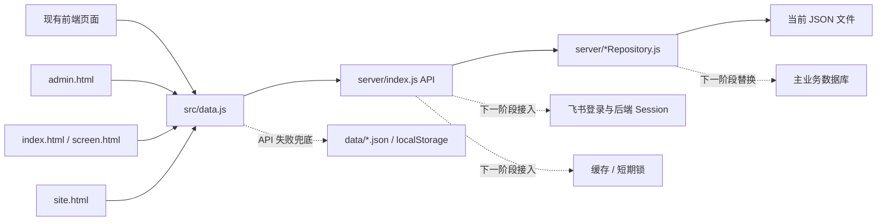

# 管理后台与平台技术架构方案 v1

更新时间：2026-06-23

## 1. 背景与目标

当前项目已经形成四类可运行界面：

- 主入口大屏：`index.html`、`src/app.js`、`src/data.js`、`src/logic.js`，负责开场、星锐卡组、赛道组队、任务倒计时、路演计时、投票结果和最终展示。
- 大屏演示 Deck：`screen.html`、`src/screen.js`、`src/screen.css`，负责独立的赛事全流程展示。
- 移动端 / 公众端：`site.html`、`src/site.js`、`src/site.css`，负责首页、星锐、新人详情、赛程、组队、作品展厅、投票、评分、角色工作台。
- 管理后台：`admin.html`、`admin.css`、`src/admin.js`，当前已经接入阶段、时间显示、任务倒计时和路演计时的基础控制。

现有服务入口是 `server/index.js`，当前已经提供静态资源服务、API 路由和若干 JSON repository。它已经不只是纯静态页面，但仍然是演示型后端：真实登录、权限校验、队伍写入、投票写入、评分写入、结果发布和审计都还没有正式落库。

本阶段目标不是重构前端，也不是替换现有页面技术栈。当前最急的是在保留现有前端的基础上，把后端做成正式可用的业务服务。

本方案目标：

- 保留现有赛博视觉调性和已经打磨过的大屏 / 移动端体验。
- 保留当前前端页面结构与交互，不做框架迁移。
- 把真实业务能力从前端本地状态和 JSON 文件迁移到后端和数据库。
- 让管理员可以在后台控制阶段、大屏、组队、投票、评分、结果发布。
- 让参赛选手、专家评委、大众评委 / 观众、管理员四类角色由后端严格分权。
- 把当前代码里已经存在的 placeholder 明确标注，防止把临时演示内容当成正式需求。

## 2. 当前代码状态判断

### 已经具备的基础

- `server/index.js` 已经提供静态资源服务和 API 路由。
- `package.json` 当前脚本非常轻量：
  - `npm run dev` / `npm start` 启动当前服务。
  - `npm test` 执行现有单元和 API 测试。
- `src/data.js` 已经是前端统一数据层：
  - 优先请求 `/api/*`。
  - API 不可用时回退到 `data/*.json` 或 localStorage。
  - 大屏、移动端、管理后台都可以逐步切换到真实后端。
- 已有 repository 雏形：
  - `server/traineeRepository.js`
  - `server/teamRepository.js`
  - `server/adminStateRepository.js`
  - `server/missionCountdownRepository.js`
  - `server/roadshowRepository.js`
  - `server/voteResultsRepository.js`
- 已有角色权限模型，定义在 `src/logic.js`：
  - `player`
  - `judge`
  - `public`
  - `admin`
- 已有测试：
  - `tests/logic.test.js`
  - `tests/server.test.js`

### 当前 API 已经存在的能力

基础能力：

- `GET /api/health`
- `GET /api/me`
- `GET /api/permissions?role=...`
- `POST /api/auth/feishu/login`

星锐资料：

- `GET /api/trainees`
- `POST /api/trainees`
- `GET /api/trainees/:id`
- `PATCH /api/trainees/:id`
- `DELETE /api/trainees/:id`
- `POST|PATCH /api/trainees/:id/sentence`

队伍与角色动作：

- `GET /api/teams`
- `POST /api/team/join`
- `POST /api/team/leave`

投票与评分：

- `GET /api/vote-results`
- `POST /api/vote/cast`
- `POST /api/vote/cancel`
- `POST /api/judge/scores`

管理后台：

- `GET /api/admin/state`
- `POST|PATCH /api/admin/stage`
- `POST|PATCH /api/admin/display-times`
- `POST|PATCH /api/admin/mission-countdown`
- `POST|PATCH /api/admin/roadshow`

倒计时与路演：

- `GET /api/mission-countdown`
- `POST /api/mission-countdown/start`
- `GET /api/roadshow`
- `POST /api/roadshow/start`

### 当前 API 的真实状态

- 星锐资料接口已经可以读写 `data/trainees.json`。
- 阶段和时间显示接口已经可以读写 `data/admin-state.json`。
- 任务倒计时接口已经可以读写 `data/mission-countdown.json`。
- 路演计时接口已经可以读写 `data/roadshow.json`。
- 队伍和投票结果目前主要是读取 JSON 文件。
- 飞书登录接口目前是占位，返回未配置状态。
- 组队、退出队伍、投票、取消投票、评委评分接口目前是占位，返回 `backend-pending` 或 `accepted: false`。
- 移动端的角色切换、组队、投票、评分草稿仍大量依赖 localStorage。
- 管理后台接口目前没有真实管理员鉴权。
- 当前没有实时推送通道，大屏和移动端主要依赖接口读取和本地状态。

### 主要风险

- JSON 文件存储不适合多人同时操作，也不适合正式投票、评分和审计。
- 角色权限目前仍可被前端模拟，正式上线必须由后端做最终校验。
- `POST /api/team/join`、`POST /api/vote/cast`、`POST /api/judge/scores` 这些核心写接口还没有真实业务写入。
- 管理后台已经有控制界面，但后台接口目前缺少鉴权、审计和结果快照。
- 大屏端还没有被后台实时控制，只能通过接口和本地状态间接同步。
- `src/site.js` 中仍有“阶段七”“阶段八”等占位快捷入口，这类内容应由需求文档或后台配置确认后再保留。

## 3. 当前代码到正式后端的过渡方式

当前前端已经通过 `src/data.js` 形成了较好的过渡层。后端建设应该优先复用这个结构，不需要推倒前端。

前端接入原则：

- 现有页面继续运行。
- `src/data.js` 继续作为统一数据访问层。
- 后端逐步补齐真实 API，前端只替换数据来源，不大改页面结构。
- 当前 JSON 文件可以作为 seed 数据导入数据库。
- 当前 localStorage 只保留为弱网或演示兜底，不再承担正式业务状态。

后端改造原则：

- 先把现有 repository 的数据源从 JSON 文件替换为数据库。
- 保持现有 API 路径尽量不变，降低前端改造成本。
- 先做 REST 接口和轮询可用，再补实时推送。
- 每个写接口必须补权限校验、参数校验、幂等处理和审计日志。
- 管理后台当前已有的阶段、倒计时、路演控制要优先正式化，因为它们已经被页面消费。

## 4. 推荐技术栈

### 前端

- 当前阶段不重构前端，不更换前端技术栈。
- 保留现有 `index.html`、`site.html`、`screen.html`、`admin.html` 页面结构。
- 保留现有 CSS 和原生 JavaScript 实现。
- 保留 `src/data.js` 作为前端统一数据访问层。
- 保留 `src/logic.js` 中的通用计算、权限定义和页面逻辑辅助函数。
- 管理后台短期继续基于 `admin.html`、`admin.css`、`src/admin.js` 扩展真实功能。
- 不引入新的前端框架，不做前端工程体系迁移。

### 后端

- 当前优先沿用现有 Node.js HTTP 服务入口。
- API 风格继续以 REST 为主。
- 主业务数据库：MySQL 8.4。
- 数据访问：优先把现有 repository 改为数据库 repository。可先用 mysql2 保持轻量，也可引入 Prisma 做模型和迁移管理。
- 缓存与会话：Redis 7，用于登录 session、飞书登录 state、短期锁、接口限流和后续实时广播。
- 分析库：ClickHouse 24.8 仅作为后续分析看板增强项，MVP 不强依赖。
- 不接 AI 应用层：当前平台不需要 Dify。
- 不接向量能力：当前平台不需要 Milvus 或 PostgreSQL + pgvector。
- 实时通信：MVP 可先用轮询；后续如需大屏秒级同步，再接 WebSocket / Socket.IO。
- 鉴权：飞书 OAuth / SSO + 后端 Session。
- 会话：HTTP-only Cookie + Redis Session，避免前端保存敏感 token。
- 文件存储：优先接企业内部对象存储；短期可先保留服务器静态目录，数据库只保存 URL 和元数据。

### 部署

- 短期保持当前静态资源和 API 同服务部署方式。
- 后端服务继续托管现有静态页面，同时提供正式 API。
- Nginx 负责 HTTPS、静态资源、反向代理和后续实时连接 Upgrade。
- Docker 可作为后续部署标准化方案，不影响当前后端优先开发。
- 复用已部署的中间件环境，业务服务通过统一网络接入主业务库和缓存服务。
- CI/CD：GitLab CI 优先；GitHub 可作为同步备份。

## 5. 当前过渡架构

核心原则：

- 前端只负责展示和交互，所有关键权限最终必须由后端判断。
- 当前已经被前端消费的 API 路径优先保持稳定。
- 当前 JSON repository 是过渡实现，不是正式存储方案。
- 管理后台每次控制阶段、倒计时、路演、投票、评分、结果，都必须落库并写审计日志。
- 大屏只读取或订阅当前状态，不直接修改业务数据。

## 6. 后端模块划分与接口落地

### AuthModule

当前状态：

- `GET /api/me` 已存在，但返回空用户和 `backend-pending`。
- `GET /api/permissions?role=...` 已存在，可以根据角色返回权限。
- `POST /api/auth/feishu/login` 已存在，但仍是占位。

下一步：

- 接入飞书登录。
- 根据飞书用户身份建立平台用户。
- 返回真实用户、角色、权限和登录态。
- 所有需要权限的接口都从后端 session 读取用户身份，不再信任前端传入角色。

### UserRoleModule

当前状态：

- 角色定义已经在 `src/logic.js`。
- 移动端可以通过 query 或登录弹窗模拟角色。
- 后端还没有用户角色表。

下一步：

- 建立账号与角色映射。
- 支持管理员配置用户为参赛选手、专家评委、大众评委、管理员。
- 未绑定用户保持无权限，不自动降级为大众评委。
- 移动端右上角“登录 / 角色”根据真实账号进入不同工作台。

### TraineeModule

当前状态：

- 已有完整 CRUD 接口。
- 已有主持词 / 个人句子保存接口。
- 当前读写 `data/trainees.json`。

下一步：

- 把 `traineeRepository` 的数据源替换为数据库。
- 保留现有 API 路径，避免大屏和移动端改动。
- 图片仍保留 URL 字段，后续再补上传能力。

### TeamModule

当前状态：

- `GET /api/teams` 已存在，当前读取 `data/teams.json`。
- `POST /api/team/join` 和 `POST /api/team/leave` 已存在，但只是占位。
- 移动端实际加入队伍仍依赖 localStorage。

下一步：

- 队伍、赛道、成员、岗位职责全部入库。
- `join` 和 `leave` 接口做真实写入。
- 补 `claim-role` 接口，支持认领业务洞察、AI 开发、产品设计、路演运营等职责。
- 做队伍容量、重复加入、角色权限、锁队校验。

### WorkModule

当前状态：

- 页面上已经有作品展厅和作品相关入口。
- 后端还没有作品提交、作品审核、作品状态接口。

下一步：

- 建立作品表。
- 支持选手提交作品标题、简介、链接、封面和演示资料。
- 支持管理员审核和发布。
- 移动端作品展厅从后端读取正式作品数据。

### VoteModule

当前状态：

- `GET /api/vote-results` 已存在，当前读取 `data/vote-results.json`。
- `POST /api/vote/cast` 和 `POST /api/vote/cancel` 已存在，但只是占位。
- 移动端投票状态仍依赖 localStorage。

下一步：

- 做真实投票窗口状态。
- 做一人一票校验。
- 做投票写入、取消和重复提交处理。
- 做投票排名和赋分计算。
- 管理后台可以开启 / 关闭投票窗口并生成结果快照。

### JudgeModule

当前状态：

- `POST /api/judge/scores` 已存在，但只是占位。
- 移动端专家评分草稿仍依赖 localStorage。

下一步：

- 建立评分任务。
- 支持评分草稿保存和最终提交。
- 后端校验评委身份。
- 管理后台展示评分进度和汇总结果。

### StageModule

当前状态：

- `GET /api/admin/state` 已存在。
- `POST|PATCH /api/admin/stage` 已存在。
- `POST|PATCH /api/admin/display-times` 已存在。
- 当前读写 `data/admin-state.json`，并记录轻量日志。

下一步：

- 阶段、时间显示和操作日志入库。
- 后端校验管理员权限。
- 阶段切换后写审计日志，并通知大屏刷新。

### TimerModule

当前状态：

- `GET /api/mission-countdown`、`POST /api/mission-countdown/start` 已存在。
- `GET /api/roadshow`、`POST /api/roadshow/start` 已存在。
- 管理后台也可以通过 `POST|PATCH /api/admin/mission-countdown` 和 `POST|PATCH /api/admin/roadshow` 更新状态。
- 任务倒计时默认 24 小时，路演计时默认 15 分钟。

下一步：

- 倒计时和路演状态入库。
- 后端统一返回 `startedAt`、`durationMs`、`serverNow`。
- 管理后台可以设置当前队伍、下一队伍、阶段、开始时间和持续时间。
- 大屏根据后端时间计算剩余时间，避免不同设备时间漂移。

### BigscreenModule

当前状态：

- 大屏页面已经具备多种展示视图。
- 当前没有统一的大屏状态接口，也没有实时推送。
- 部分页面读取倒计时、路演、投票结果 API。

下一步：

- 建立当前大屏页面状态。
- 支持后台推送首页、组队、任务倒计时、路演计时、投票进度、投票结果、最终冠军。
- MVP 可先让大屏轮询状态。
- 后续再接实时通道。

### AuditModule

当前状态：

- `adminStateRepository` 中有轻量日志。
- 还没有独立审计日志接口和审计表。

下一步：

- 所有管理员写操作都必须进入审计日志。
- 投票、评分、阶段发布、结果发布等关键事件也要记录。
- 后台提供审计日志查询和导出。

## 7. 数据模型建议

当前 JSON 文件与正式表的映射：

- `data/trainees.json` -> `trainees`
- `data/teams.json` -> `teams`、`team_members`
- `data/admin-state.json` -> `event_stages`、`audit_logs`
- `data/mission-countdown.json` -> `mission_countdowns`
- `data/roadshow.json` -> `roadshow_sessions`
- `data/vote-results.json` -> `result_snapshots` 或投票统计视图

正式核心业务表：

- `users`：飞书用户、姓名、头像、open_id、union_id、部门。
- `role_assignments`：用户角色、来源、状态、更新时间。
- `trainees`：星锐资料。
- `teams`：队伍、赛道、项目方向、状态。
- `team_members`：队伍成员、岗位职责、加入时间、是否赛道顾问。
- `works`：作品标题、说明、技术标签、提交状态、展示状态。
- `votes`：投票人、作品 / 队伍、投票时间、来源。
- `judge_scores`：评委、队伍、维度分、总分、评语、草稿 / 提交状态。
- `event_stages`：活动阶段、当前状态、时间。
- `bigscreen_state`：当前大屏页面、参数、更新时间。
- `roadshow_sessions`：当前路演队伍、下一队、开始时间、持续时间。
- `mission_countdowns`：任务倒计时开始时间、持续时间。
- `result_snapshots`：最终结果发布快照，发布后不可直接覆盖。
- `audit_logs`：操作人、动作、对象、前后值、IP、时间。
- `requirement_items`：需求来源、状态、对应页面，防止 AI 误做需求。

可选分析数据：

- `event_logs`：页面访问、大屏切换、按钮点击、投票窗口状态变化。
- `vote_events`：投票事件明细，用于趋势图和实时大屏统计。
- `score_events`：评分提交、评分修改、评分进度事件。
- `screen_play_events`：大屏页面播放、推送、回放和异常断连事件。

缓存服务用于短期状态：

- 登录 session。
- 飞书登录临时 state。
- 投票窗口和阶段状态缓存。
- 防重复提交的短期锁。
- 后续多实例实时广播状态。

本项目当前不使用 AI 应用平台、向量检索或向量数据库：

- 不做后台 AI 助手。
- 不做需求文档问答。
- 不做向量检索。
- 不引入向量数据库。
- 作品说明、赛道资料、评分材料都先按普通结构化字段和文件链接管理。

## 8. 管理后台页面规划

### 8.1 当前已经接入的控制项

- 阶段状态读取。
- 阶段切换。
- 时间显示配置。
- 任务倒计时配置。
- 路演计时配置。
- 轻量操作日志展示。

### 8.2 当前仍是规划或占位的后台能力

- 大屏页面推送。
- 页面文案管理。
- 星锐资料管理界面。
- 队伍成员管理。
- 投票窗口开关。
- 投票结果快照。
- 专家评分进度。
- 最终结果发布。
- 用户与权限管理。
- 独立审计日志查询。

### 8.3 后台下一步优先级

第一优先级：

- 飞书登录和管理员权限。
- 阶段、倒计时、路演控制入库。
- 管理员操作审计。

第二优先级：

- 队伍成员管理。
- 投票窗口管理。
- 专家评分进度。
- 结果发布快照。

第三优先级：

- 页面文案管理。
- 作品资料管理。
- 多屏房间管理。
- 分析看板。

## 9. 同步方案

当前代码状态：

- 还没有实时通道。
- 大屏、移动端、管理后台主要通过 API 加载状态。
- 倒计时和路演计时依赖 `startedAt`、`durationMs`、`serverNow` 计算。
- API 失败时，前端会回退到本地 JSON 或 localStorage。

MVP 同步方案：

1. 管理员点击后台按钮。
2. 后端校验管理员权限。
3. 后端写数据库。
4. 后端写审计日志。
5. 前端通过接口重新读取最新状态。
6. 大屏在关键页面定时拉取状态。

后续实时方案：

- `bigscreen:main`：主会场大屏。
- `bigscreen:test`：测试大屏。
- `admin`：后台管理端。
- `public`：移动端公共状态。
- `user:{userId}`：单个用户状态。

典型事件：

- `stage.changed`
- `bigscreen.pageChanged`
- `missionCountdown.updated`
- `roadshow.updated`
- `vote.windowOpened`
- `vote.windowClosed`
- `vote.resultsUpdated`
- `result.published`

## 10. 权限设计

当前代码中的角色：

- `admin`：管理员。
- `player`：参赛选手。
- `judge`：专家评委。
- `public`：大众评委 / 观众。

当前代码中的权限字段：

- `canJoinTeam`
- `canSubmitWork`
- `canVote`
- `canScore`
- `canAdmin`
- `canControlBigscreen`
- `canViewTeamProgress`

正式后端需要补齐的权限原则：

- 前端根据权限隐藏入口。
- 后端根据权限拒绝非法操作。
- 管理员不参与组队、投票和专家评分，只做管理。
- 专家评委不能加入队伍，也不能投大众票。
- 大众评委 / 观众不能加入队伍，也不能评分。
- 参赛选手可以加入队伍、认领职责、提交作品，但不能投票和评分。
- 未绑定账号不允许默认访问角色功能。

## 11. 防止“AI 误做需求”的机制

当前代码里已经出现了一些偏占位的内容，例如移动端快捷入口中的“阶段七”“阶段八”。这类内容不能默认为正式需求。

后端和后台要引入需求来源管理：

- 每个可配置页面功能必须绑定来源。
- 来源可以是飞书需求文档章节、管理员配置、会议确认。
- 没有来源的内容只能是草稿，不进入正式菜单。
- 后台页面管理中显示“需求来源”和“上线状态”。

状态建议：

- `draft`：草稿。
- `confirmed`：已确认。
- `implemented`：已实现。
- `deprecated`：废弃。

## 12. 分期落地计划

### Phase 1：锁定当前 API 契约

目标：

- 保留当前页面。
- 按 `src/data.js` 和 `src/site.js` 梳理所有已消费接口。
- 明确哪些接口已经真实写入，哪些只是 placeholder。
- 形成接口字段文档和错误码规则。

交付：

- 当前原生页面继续可运行。
- 现有测试通过。
- 前端正在调用的 API 路径不随意改名。

### Phase 2：数据库替换 JSON repository

目标：

- 建立正式数据表。
- 将当前 JSON 文件导入为 seed 数据。
- 把现有 repository 的读写从 JSON 文件替换为数据库。
- 保持 API 路径稳定。

交付：

- 星锐资料、阶段、倒计时、路演、队伍、投票结果从数据库读取。
- 管理后台已有控制项写入数据库。
- JSON 文件不再作为正式运行数据源。

### Phase 3：飞书登录与后端权限

目标：

- 接入飞书登录。
- 后端根据账号返回角色。
- 未绑定用户进入无权限状态。
- 后端成为权限最终判断方。

交付：

- `GET /api/me` 返回真实用户。
- `admin`、`player`、`judge`、`public` 四类角色生效。
- 管理端接口必须校验管理员身份。

### Phase 4：核心业务写接口

目标：

- 组队写入。
- 岗位职责认领。
- 作品提交。
- 大众投票。
- 专家评分。
- 结果快照。

交付：

- `POST /api/team/join` 和 `POST /api/team/leave` 真实生效。
- 投票写入和取消真实生效。
- 评分草稿和提交真实生效。
- 最终结果由后端计算并生成快照。

### Phase 5：现有管理后台接入完整能力

目标：

- 不重写后台前端框架。
- 在现有后台页面上接入真实接口。
- 左侧菜单从视觉占位逐步变成真实模块。

交付：

- 控制台。
- 流程控制。
- 大屏控制。
- 内容管理。
- 队伍成员。
- 投票评分。
- 结果发布。
- 用户权限。
- 操作日志。

### Phase 6：大屏同步与部署验收

目标：

- 先让后台通过 API 控制大屏状态。
- 再根据现场稳定性要求接入实时通道。
- 接入反向代理、HTTPS、主业务库和缓存服务。
- 建立数据备份策略。

交付：

- 大屏可以稳定读取后台状态。
- 投票、倒计时、路演、结果可由后台控制。
- 测试环境和正式环境可部署。
- 权限验收清单完成。

## 13. 测试策略

当前已有测试应继续保留：

- `npm test`
- `tests/logic.test.js`
- `tests/server.test.js`

需要继续补充的测试：

- 权限矩阵。
- 计分公式。
- 投票排名赋分。
- 队伍容量与岗位职责。
- 阶段切换规则。
- 未登录访问。
- 不同角色访问不同接口。
- 重复投票。
- 重复评分提交。
- 管理员发布结果。

视觉和端到端验证：

- 大屏 1920×1080。
- 大屏 2048×1152。
- 移动端 390×844。
- 移动端 430×932。
- 管理后台 1440×900。
- 管理后台 1920×1080。

## 14. 我建议的最终路线

当前路线应明确为“后端先行，前端保留”：

1. 保留现有大屏、移动端、管理后台和当前前端技术栈。
2. 先锁定当前代码已经消费的 API 契约。
3. 先把 JSON repository 替换为正式数据库 repository。
4. 再接飞书登录、后端 session 和角色权限。
5. 然后补齐组队、投票、评分、作品、结果发布这些核心写接口。
6. 管理后台先在现有页面上补真实能力，不作为当前阶段的重构项目。
7. 大屏同步先用 API 拉取跑通，再根据现场需要补实时推送。
8. 不规划 AI 应用平台和向量检索，除非后续出现明确的新需求。

这样可以最大化复用当前已经完成的前端界面，同时把正式活动真正依赖的后端能力尽快做出来。
