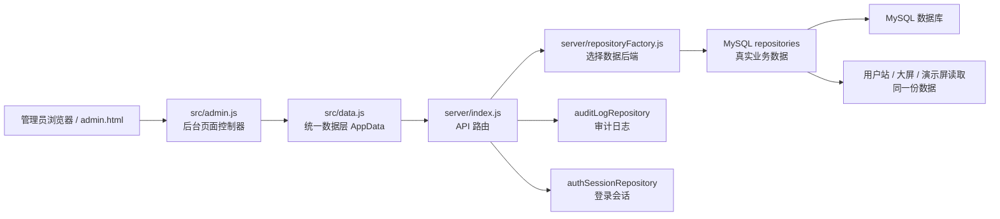
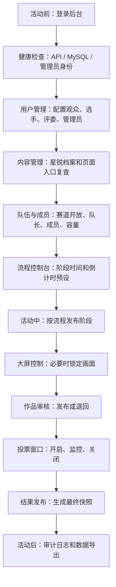

# 管理员端 SOP 与优化清单

更新时间：2026-06-25  
作者：Jan  
适用对象：活动管理员、产品负责人、现场执行同学

## 0. 先记住几个关键词

- SOP（Standard Operating Procedure，标准操作流程）：把“谁在什么时候做什么、点哪个入口、影响哪个数据”写成固定步骤，减少现场临时判断。
- 管理员端：本项目的后台页面，入口是 `admin.html`，主要脚本是 `src/admin.js`，主要样式是 `admin.css`。
- API（Application Programming Interface，应用程序接口）：前端页面和后端交换数据的地址，例如 `/api/teams`、`/api/admin/stage`。
- MySQL：当前本地服务健康检查返回的真实数据库后端，接口返回 `dataBackend=mysql`，说明不是前端假数据。
- Session（会话）：用户登录后的身份状态。后台页面会检查当前用户是否有 `admin` 角色。
- 审计日志：关键后台写操作的记录，例如切阶段、改投票状态、加成员、删成员，用于复盘和排查。
- 最终快照：发布结果时生成的一份固定结果记录。它的意义是把当时的投票和评分结果固化，避免后续数据变化影响已公布结果。
- `roleKey`（角色标识）：成员在队伍中的角色编码。当前 `advisor` 表示队长位。

## 1. 一句话总判断

当前管理员端已经不是静态展示后台，而是一个“赛事流程控制台 + 数据运营台 + 权限管理台”。它能控制阶段、大屏、倒计时、路演、队伍成员、投票窗口、作品审核、结果发布、用户角色、星锐档案和审计日志。

直接证据：

- `admin.html` 定义了 10 个后台视图：控制台、流程控制台、大屏控制、页面管理、内容管理、数据与投票、队伍与成员、用户管理、系统设置、操作日志。
- `src/admin.js` 负责视图切换、业务数据刷新、阶段发布、投票窗口、队伍成员、作品审核、用户管理等交互。
- `src/data.js` 把后台操作统一转成 `/api/*` 请求。
- `server/index.js` 提供对应后端接口。
- `server/repositoryFactory.js` 在 `DATA_BACKEND=mysql` 时切换到 MySQL repository。

运行时抽查：

- `GET /api/health` 返回 `{"status":"ok","runtime":{"api":"server/index.js","dataBackend":"mysql"}}`。
- `GET /api/admin/state` 当前阶段为 `icebreaker`，即“新生破冰”。
- `GET /api/teams` 返回 5 条赛道，每条赛道 `capacity` 为 5，并包含队长位和成员列表。
- `GET /api/vote-results` 当前窗口状态为 `published`，即“结果已发布”。

## 2. 整机地图

解释：

- `admin.html` 是页面骨架。
- `src/admin.js` 是后台的“操作指挥层”，负责按钮、表单、视图切换和渲染。
- `src/data.js` 是“前端数据层”，所有后台请求都从这里统一发出。
- `server/index.js` 是“后端入口”，负责权限校验、路由分发、写审计日志。
- `repositoryFactory` 是“数据后端切换器”，当前运行时是 MySQL。

## 3. 管理员端模块地图

| 模块 | 管理员看到的入口 | 主要用途 | 核心证据文件 |
| --- | --- | --- | --- |
| 控制台 | 控制台 | 看当前阶段、赛道成员、总票数、作品审核、最终快照、评分覆盖、审计数量 | `admin.html`、`src/admin.js#renderDashboardSummary` |
| 流程控制台 | 流程控制台 | 开启下一阶段、结束当前阶段、设置阶段展示时间、看大屏预览、关闭投票、发布结果 | `admin.html`、`src/admin.js#publishStage`、`server/index.js /api/admin/stage` |
| 大屏控制 | 大屏控制 | 将大屏锁定到某个阶段，或恢复跟随流程 | `src/admin.js#renderScreenControl`、`/api/admin/screen-override` |
| 页面管理 | 页面管理 | 打开用户站、大屏、后台、API 检查等页面 | `src/admin.js#renderPageManager` |
| 内容管理 | 内容管理 | 维护星锐档案，查看内容数据入口 | `admin.html`、`src/admin.js#renderTraineeProfileManager`、`/api/trainees` |
| 数据与投票 | 数据与投票 | 管理投票窗口、查看完整排名、审核作品 | `src/admin.js#renderVoteWindowManager`、`/api/admin/vote-window`、`/api/admin/works/:id/status` |
| 队伍与成员 | 队伍与成员 | 开放/锁定组队，添加/删除成员和队长，查看五人阵容 | `src/admin.js#renderTeamRoster`、`/api/admin/team-members` |
| 用户管理 | 用户管理 | 配置观众、选手、评委、管理员角色 | `src/admin.js#renderUserRoleManager`、`/api/admin/users` |
| 系统设置 | 系统设置 | 查看运行时配置和 API 模式 | `src/admin.js#renderSystemSettings`、`/api/health` |
| 操作日志 | 操作日志 | 查询后台关键操作记录 | `src/admin.js#loadAuditTrail`、`/api/admin/audit-logs` |

## 4. 活动前 SOP

### 4.1 登录与健康检查

1. 打开后台：`/admin` 或 `/admin.html`。
2. 确认右上角当前用户是管理员。
3. 看顶部 `API 连接正常` 和同步状态。
4. 打开“系统设置”，确认运行时显示前后端连接正常。
5. 必要时访问 `/api/health`，确认 `dataBackend=mysql`。

如果后台被跳回用户站，说明当前 session 没有 `admin` 角色。这个检查由 `server/index.js` 的受保护页面逻辑完成。

### 4.2 配置用户角色

路径：管理员端 -> 用户管理

1. 点击“新增用户”。
2. 填用户 ID、姓名、部门。
3. 勾选角色：观众、选手、评委、管理员。
4. 保存用户权限。
5. 用搜索框按姓名、用户 ID、部门复查。

角色解释：

- 观众：主要用于投票。
- 选手：主要用于加入队伍、提交作品。
- 评委：主要用于评分。
- 管理员：可以进入后台和执行管理操作。

证据：

- 页面表单在 `admin.html` 的“用户管理”模块。
- 前端提交逻辑在 `src/admin.js#upsertUserRole`。
- 后端接口是 `GET /api/admin/users` 和 `POST|PATCH /api/admin/users`。

### 4.3 配置星锐档案

路径：管理员端 -> 内容管理 -> 星锐档案

1. 点击“新增星锐”。
2. 填档案 ID、中文姓名、英文名、部门、头像路径、表情包路径、个人展示语等。
3. 保存档案。
4. 在列表中点击“编辑”或“删除”复查。
5. 到用户站或大屏检查新人详情是否同步。

证据：

- 表单字段在 `admin.html` 的“星锐档案”模块。
- 加载、保存、删除逻辑在 `src/admin.js#loadTraineeProfiles`、`saveTraineeProfile`、`deleteTraineeProfile`。
- 后端接口是 `/api/trainees`。

### 4.4 配置赛道与成员

路径：管理员端 -> 队伍与成员

1. 先看每个赛道的当前人数，例如 `4/5 人` 或 `5/5 人`。
2. 需要允许选手自行加入时，点击“开放组队”。
3. 需要冻结该赛道时，点击“锁定组队”。
4. 管理员手动添加成员时，在“成员维护”里选择目标赛道。
5. 填用户 ID、姓名、部门、角色 Key、职责、头像路径。
6. 保存队员。
7. 删除成员时，在队伍成员卡片上点击“移除”。

队长规则：

- 队长也是成员，计入五人总人数。
- 添加队长时，`角色 Key` 填 `advisor`，职责可填 `队长`。
- 删除队长时，队长卡片上也有“移除”按钮。
- 数据层为了兼容历史结构，队长位在 MySQL 中通过 `team_members.is_advisor = TRUE` 标识。

证据：

- 队伍页面在 `admin.html` 的“队伍与成员”模块。
- 队伍渲染在 `src/admin.js#renderTeamRoster`。
- 成员添加和删除在 `src/admin.js#saveAdminTeamMember`、`removeAdminTeamMember`。
- 后端接口是 `POST /api/admin/team-members` 和 `DELETE /api/admin/team-members`。
- MySQL 队长识别在 `server/mysqlTeamRepository.js`。

## 5. 活动中 SOP

### 5.1 流程阶段控制

路径：管理员端 -> 流程控制台

1. 看“当前阶段”。
2. 活动进入下一个环节时，点击“开启下一阶段”。
3. 如果要直接指定某个阶段，在阶段表格中点击对应行的“发布阶段”。
4. 修改展示时间后，点击“保存阶段时间”。
5. 到大屏确认阶段是否切换。

注意：

- 阶段切换会影响大屏展示。
- 当前阶段数据来自 `/api/admin/state`。
- 写入接口是 `/api/admin/stage`。

### 5.2 大屏画面控制

路径：管理员端 -> 大屏控制

1. 默认大屏跟随流程阶段。
2. 如果现场需要临时固定某个画面，点击对应阶段的“设为当前”。
3. 固定后，该阶段会显示“已锁定”。
4. 需要恢复自动跟随时，点击“取消锁定”。

术语解释：

- 大屏锁定：让展示端停留在某个阶段画面，不随流程阶段自动变化。
- 跟随流程：大屏根据当前阶段自动切换。

证据：

- 前端逻辑在 `src/admin.js#toggleScreenOverride`。
- 后端接口是 `/api/admin/screen-override`。

### 5.3 倒计时与路演计时

路径：管理员端 -> 流程控制台 -> 时间控制

任务倒计时：

1. 输入展示时长，默认 1440 分钟。
2. 点击“启动”。
3. 如需重来，点击“重置”。

路演计时：

1. 输入展示时长，默认 15 分钟。
2. 选择当前路演队伍。
3. 选择下一队伍。
4. 点击“启动”。
5. 路演结束或误操作时点击“重置”。

证据：

- 前端逻辑在 `src/admin.js#updateMissionCountdown` 和 `updateRoadshow`。
- 后端接口是 `/api/admin/mission-countdown` 和 `/api/admin/roadshow`。

### 5.4 作品审核

路径：管理员端 -> 数据与投票 -> 作品提交与审核

1. 点击“刷新数据”。
2. 查看每个队伍提交的作品。
3. 内容确认无误后点击“发布作品”。
4. 内容需要修改时点击“退回修改”。
5. 回到控制台看“作品审核”数量。

证据：

- 作品列表渲染在 `src/admin.js#renderWorkList`。
- 审核动作在 `src/admin.js#updateWorkReviewStatus`。
- 后端接口是 `/api/admin/works/:id/status`。

### 5.5 投票窗口控制

路径：管理员端 -> 数据与投票 -> 投票窗口

1. 活动进入投票阶段前，确认作品已发布。
2. 点击“开启投票”。
3. 现场观察实时投票排名。
4. 投票结束时点击“关闭投票”。
5. 结果确认后点击“标记发布”。

另一个入口：

- 流程控制台右侧“安全确认”里也有“关闭投票”和“发布结果”。
- 这里需要先勾选“我已确认当前操作”。

证据：

- 投票窗口按钮在 `admin.html`。
- 前端动作在 `src/admin.js#updateAdminVoteWindow`。
- 后端接口是 `/api/admin/vote-window`。

### 5.6 最终结果发布

路径：管理员端 -> 数据与投票 或 流程控制台 -> 安全确认

1. 确认投票窗口已关闭。
2. 确认评委评分已经到齐。
3. 点击“标记发布”或在安全确认区点击“发布结果”。
4. 后端会读取投票数据和评委评分，生成最终结果快照。
5. 回到控制台查看“最终快照”是否显示“已发布”。
6. 到大屏确认结果页展示正常。

术语解释：

- 结果快照：发布时固定下来的结果版本。它不等于实时票数列表，而是正式公布结果。

证据：

- 前端动作在 `src/admin.js#updateAdminVoteWindow`。
- 后端发布接口是 `/api/admin/results/publish`。
- 最新快照读取接口是 `/api/results/latest`。

## 6. 活动后 SOP

1. 打开“操作日志”，刷新日志。
2. 检查阶段切换、投票窗口、结果发布、队伍成员、作品审核是否有记录。
3. 打开“数据与投票”，确认结果快照仍可读取。
4. 打开“页面管理”，逐个复查用户站、大屏、演示屏入口是否正常。
5. 保留当前数据库和日志，避免活动结束后继续修改正式数据。

当前缺口：

- 已补齐一键导出：队伍名单、投票排名、作品列表、评委评分、最终结果、审计日志。
- 操作日志已支持按操作类型、操作人、对象类型筛选，并可展开查看详情。
- 数据与投票页已补充手动开启的自动刷新开关，适合现场盯票数、作品和评分状态。

## 7. 异常处理 SOP

### 7.1 后台打不开

先判断：

- 如果跳到用户站并带 `denied=1`，通常是没有管理员权限。
- 如果页面空白，先检查服务是否运行。

处理：

1. 打开 `/api/health`。
2. 如果不是 `status=ok`，先重启服务。
3. 如果服务正常但无法进后台，去“用户管理”确认当前用户是否有 `admin` 角色。

### 7.2 页面数据不更新

处理：

1. 点击当前模块的“刷新数据”或“刷新日志”。
2. 看顶部同步状态是否变成“业务数据已同步”。
3. 打开 `/api/teams`、`/api/vote-results` 等接口判断后端是否已变。
4. 如果接口已变但页面没变，刷新浏览器。

### 7.3 队伍成员加错或删错

处理：

1. 在“队伍与成员”里找到目标赛道。
2. 点错成员卡片的“移除”。
3. 重新用“成员维护”添加正确成员。
4. 队长添加时 `roleKey=advisor`。

### 7.4 阶段切错

处理：

1. 如果只是大屏画面错，用“大屏控制”锁定正确画面。
2. 如果后台当前阶段错，在“流程控制台”发布正确阶段。
3. 操作后查看“操作日志”，记录现场修正。

### 7.5 投票或结果误操作

处理：

1. 如果只是误开投票，立即切到“关闭投票”。
2. 如果已经发布最终结果，先不要继续反复发布。
3. 查看“最终快照”和“操作日志”确认发布时间和发布人。
4. 如果需要回滚或重发，应先明确业务规则，再处理数据库，不建议现场手改。

## 8. 当前最值得优化的点

### P0：危险操作入口要统一二次确认

直接证据：

- “流程控制台”的安全确认区对关闭投票、发布结果做了勾选确认。
- “数据与投票”里的“开启投票 / 关闭投票 / 标记发布”按钮可以直接触发 `updateAdminVoteWindow`。

推理结论：

- 同一个危险动作存在两个入口，但确认强度不同。现场容易误点。

建议：

- 所有 `closed` 和 `published` 操作统一弹确认框。
- 发布结果前显示摘要：投票状态、总票数、评分覆盖、将生成快照。

### P0：正式上线要开启严格权限模式

直接证据：

- `server/index.js` 中管理写接口会调用 `enforcePermission(..., "canAdmin")`。
- 代码支持 `AUTH_ENFORCEMENT=strict`。

推理结论：

- 当前本地开发环境为了方便调试，仍有本地登录和角色切换能力。正式环境应强制依赖真实 session 和角色表。

建议：

- 正式联调开启 `AUTH_ENFORCEMENT=strict`。
- 确认飞书登录、管理员白名单、Session 后端配置。

### P1：队伍成员维护表单需要从自由输入升级为选择器

直接证据：

- 当前成员维护表单要求手填用户 ID、姓名、角色 Key、头像路径。

推理结论：

- 手填容易导致同一人多个 ID、头像路径写错、`advisor` 写错等问题。

建议：

- 从“用户管理”里选择现有用户。
- `roleKey` 改成下拉：队长、产品、研发、算法、展示、其他。
- 队长选项自动写入 `roleKey=advisor`。

### P1：结果、队伍、投票需要导出能力

直接证据：

- 数据与投票页已有 CSV 导出按钮：队伍、票数、作品、评分、结果。
- 操作日志页已有审计日志 CSV 导出按钮。

推理结论：

- 当前已经能交付 CSV 文件，Excel 可以直接打开。后续如果需要更正式的汇报格式，再升级为 `.xlsx` 或固定模板。

建议：

- 后续优化为模板化 Excel，并补充导出时间、活动名称和操作人。

### P1：后台数据建议定时自动刷新

直接证据：

- `src/admin.js#loadBusinessData` 在进入部分视图、点击刷新和开启自动刷新后触发。
- 数据与投票页提供自动刷新开关，间隔可选 5 秒、10 秒、30 秒。

推理结论：

- 现场盯投票、作品、评分时，可以开启自动刷新；默认仍为手动刷新，避免管理员正在查看数据时被频繁刷新干扰。

建议：

- 后续可把控制台也接入自动刷新，并增加“最近一次刷新耗时”。

### P1：审计日志需要筛选和详情

直接证据：

- 当前后台能读取 `/api/admin/audit-logs`，页面已支持按操作类型、操作人、对象类型筛选，并可展开查看详情。

推理结论：

- 当前已经覆盖现场最常用的筛选维度。更细的时间范围和 before / after 差异对比仍可继续增强。

建议：

- 后续增加时间范围、对象 ID 搜索和 before / after 差异高亮。

### P2：系统设置目前更像“系统状态”

直接证据：

- `src/admin.js#renderSystemSettings` 主要展示运行时信息，没有可编辑配置。
- 页面文案已从“系统设置”调整为“系统状态”。

推理结论：

- 如果叫“系统设置”，用户会期待可以修改配置。

建议：

- 中期加入可编辑配置：活动名称、默认投票状态、路演时长、结果发布策略。

### P2：错误信息应展示后端返回原因

直接证据：

- 多数失败提示是“保存失败”“同步失败”，具体原因只 `console.warn`。

推理结论：

- 现场非开发人员看不到浏览器控制台，很难判断是权限、数据、网络还是校验问题。

建议：

- `fetchJson` 读取后端错误 message。
- 页面 toast 或状态栏展示具体错误，例如“队伍已满”“没有管理员权限”“投票已关闭”。

## 9. 建议的管理员端主 SOP

## 10. 如果只记住三句话

1. 管理员端的主线是：先配人和内容，再控流程和大屏，最后控投票和结果。
2. 当前后台已经接入真实 MySQL，不应该再按“假数据页面”理解。
3. 最需要优先优化的是危险操作确认、正式权限模式、成员维护选择器和结果导出。

## 11. 结构索引

- 页面骨架：`admin.html`
- 页面样式：`admin.css`
- 后台交互控制器：`src/admin.js`
- 前端统一数据层：`src/data.js`
- 后端 API 路由：`server/index.js`
- 数据后端选择：`server/repositoryFactory.js`
- MySQL 队伍逻辑：`server/mysqlTeamRepository.js`
- MySQL 用户角色逻辑：`server/mysqlUserRoleRepository.js`
- MySQL 投票逻辑：`server/mysqlVoteResultsRepository.js`
- MySQL 作品逻辑：`server/mysqlWorksRepository.js`
- MySQL 结果快照逻辑：`server/mysqlResultSnapshotsRepository.js`
- MySQL 审计日志逻辑：`server/mysqlAuditLogRepository.js`
